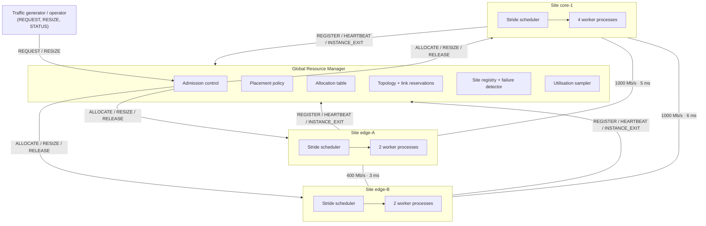
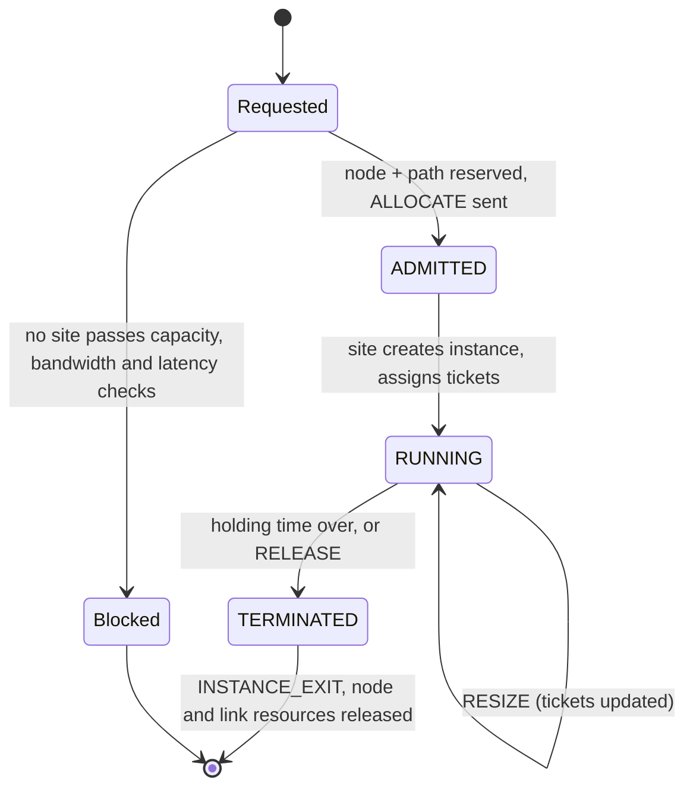
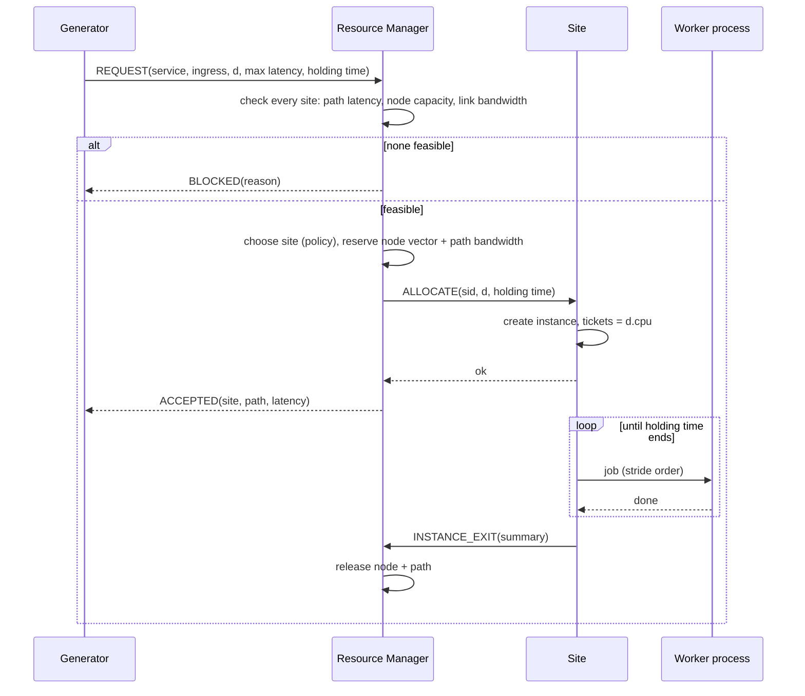

# Milestone 1 – Distributed Operating System Foundation
**Theme 3: Distributed Telecom Resource Management System (TeleRM)**
ICS 2403 – Distributed Computing & Applications · Week 1 · System version S1

---

## 1. Problem and scope

A telecom operator runs network functions such as vRAN distributed units (DU), user-plane
functions (UPF), IMS voice servers, video transcoders and IoT gateways on compute spread
across **edge sites** (close to users, small) and **core data centres** (far, large). Each
function needs CPU, memory and interface bandwidth. If it is hosted away from where its
traffic enters, it also consumes **transport bandwidth** on every link in between and adds
**latency**, which some functions cannot tolerate: a DU needs about 2 ms.

Requests arrive and leave continuously, so allocation must be dynamic. Each request is
admitted or blocked, placed, possibly resized while running, and released when its holding
time ends. S1 builds the foundation for this: nodes that own resources, processes that hold
allocations, an allocator that decides where each process runs, enforcement of the
allocation on the node, and the communication that ties it together.

> **System = Nodes + Processes + Resources + Communication**

## 2. Distributed OS vs network OS – where S1 sits

| Property | Network OS | Distributed OS | TeleRM S1 |
|---|---|---|---|
| Where a function runs | Operator picks a server and deploys there | System decides | Resource manager decides from capacity, path bandwidth and latency |
| Resource view | Per server | Global | Global table of every site **and every link** |
| Identity | Local PIDs per server | System-wide | Global service-instance IDs (`S00001` …) |
| Enforcement | Local OS only | Coordinated | Allocation decided globally, enforced locally by a stride scheduler |
| Node autonomy | Full | Low | Sites expire instances and schedule CPU on their own |

S1 is a **middleware-based distributed OS layer** over ordinary host OSes. It has a single
admission interface, global IDs, and global resource and network accounting. There is no
migration or shared state yet; those come in Week 9 and Week 11.

## 3. System architecture

### 3.1 Nodes and network

| Node | Tier | CPU (millicores) | Memory (MB) | Interface (Mb/s) | Worker processes |
|---|---|---|---|---|---|
| `manager` | control | – | – | – | – |
| `edge-A` | edge | 4 000 | 4 096 | 2 000 | 2 |
| `edge-B` | edge | 4 000 | 4 096 | 2 000 | 2 |
| `core-1` | core | 12 000 | 16 384 | 10 000 | 4 |

| Link | Capacity | Latency |
|---|---|---|
| edge-A ↔ core-1 | 1 000 Mb/s | 5 ms |
| edge-B ↔ core-1 | 1 000 Mb/s | 6 ms |
| edge-A ↔ edge-B | 400 Mb/s | 3 ms |

Every node is a separate OS process with its own TCP port. They can run on one machine or
several; the README explains both.

### 3.2 Responsibilities of the distributed-OS layer

| OS responsibility | Where | Mechanism |
|---|---|---|
| Process management | Manager + site | Global IDs and allocation table. Sites create, resize and terminate instances |
| Process scheduling | Two levels | Global: placement policy. Local: stride scheduling proportional to allocated CPU |
| Resource allocation | Manager | Reserve node vector **and** path bandwidth; release on exit; resize in place |
| Network resource management | Manager | Topology graph, shortest-latency paths, per-link reservations |
| Communication | All nodes | Length-prefixed JSON over TCP, request/reply |
| Naming (basic) | Manager | Static site-id → address table |
| Failure detection (basic) | Manager | Heartbeat timeout marks a site `SUSPECT` and excludes it from placement |

## 4. Process model

Processes exist at **two levels**:

1. **OS processes (real).** The manager, each site, and each site's worker pool are OS
   processes. The run report prints the worker PIDs.
2. **Service-instance processes (logical).** Each admitted request becomes an instance with a
   global ID, a resource allocation, a holding time and a state. While it runs, it is
   *backlogged*: it always has traffic-processing jobs waiting. The site's scheduler decides
   how often it gets a worker, and the jobs execute in the worker OS processes.

### 4.1 Instance record

| Field | Meaning |
|---|---|
| `sid` | Global instance ID from the manager |
| `service`, `ingress` | Service type; the site where its traffic enters |
| `demand` | Current allocation d = (cpu, mem, bw) |
| `holding_s`, `expires_at` | Lifetime of the allocation |
| `tickets`, `stride`, `pass_value` | Stride-scheduling state (tickets = allocated millicores) |
| `jobs_done`, `busy_s`, `latency_sum_ms` | What the instance actually received |

### 4.2 Life cycle

### 4.3 Request handling (end to end)

### 4.4 Local scheduling: stride scheduling

Every running instance *i* holds tickets t_i equal to its allocated millicores. Its stride is

$$\text{stride}_i = \frac{10^6}{t_i}$$

When a worker is free, the site dispatches the eligible instance with the smallest pass
value, then adds its stride:

$$\text{pass}_i \leftarrow \text{pass}_i + \text{stride}_i$$

Over any busy interval, instance *i* therefore receives CPU in proportion to t_i. This is
how an allocation decided globally is **enforced** locally.

Two rules keep this sound. First, an instance may run at most ⌈cpu_i / 1000⌉ jobs at once,
so a 1-core allocation cannot occupy four workers. Second, a new instance starts at the
current minimum pass, so it can neither starve others nor be starved.

Enforcement is checked every heartbeat with **Jain's fairness index** over normalised
throughput x_i = jobs_i / t_i:

$$J = \frac{\left(\sum x_i\right)^2}{n \sum x_i^2}$$

J = 1 means every instance received exactly its share. Samples are only taken when the site
is saturated (slot utilisation above 90 %), because an idle site gives everyone more than
their share.

## 5. Resource model

### 5.1 Node and network resources

Node resources form a vector R = (cpu, mem, bw), with capacity C_j and allocation A_j per
site. The network is a graph G = (V, E). Each link e has capacity B_e and latency λ_e.

A request r has demand d_r, ingress site g_r and latency bound L_r. Placing it on site j
uses the shortest-latency path P(g_r, j). Admission requires all three of the following:

$$A_j + d_r \le C_j \quad \text{(node capacity)}$$

$$\text{alloc}_e + d_r^{bw} \le B_e \;\; \forall e \in P(g_r, j) \quad \text{(link bandwidth)}$$

$$\sum_{e \in P(g_r, j)} \lambda_e \le L_r \quad \text{(latency bound)}$$

Node and path are reserved together, before ALLOCATE is sent, and rolled back if the site
does not answer. They are released together on INSTANCE_EXIT.

A **resize** changes only CPU. It is accepted if the extra CPU fits the node's free capacity;
shrinking always succeeds. Moving an instance to another site to satisfy a resize is Week 9
(migration).

### 5.2 Placement policies

| Policy | Rule (among feasible sites) | Intent |
|---|---|---|
| `edge_first` (default) | Ingress site first, then lowest path latency, then least loaded | Keep traffic local, save transport bandwidth |
| `least_loaded` | Smallest dominant share after placement | Spread load |
| `best_fit` | Smallest dominant free share after placement | Pack tightly, keep large holes |

### 5.3 Service catalogue (workload)

| Service | CPU | Mem | BW (Mb/s) | Max latency | Share of arrivals |
|---|---|---|---|---|---|
| vRAN-DU | 1500 | 512 | 300 | 2 ms | 20 % |
| UPF | 1000 | 512 | 400 | 10 ms | 20 % |
| IMS-CSCF | 500 | 256 | 50 | 50 ms | 20 % |
| Transcoder | 2000 | 1024 | 200 | 50 ms | 15 % |
| IoT-GW | 250 | 128 | 20 | 100 ms | 25 % |

Arrivals are Poisson (default 2 per second for 30 s), and holding times are exponential
(mean 8 s). 25 % of arrivals are followed by a resize request (×0.5, ×1.5 or ×2) against a
random accepted instance. Everything is seeded (`seed = 42`).

The DU's 2 ms bound means it can only ever run at its ingress edge, because every link has
latency of at least 3 ms. The core is never an option for it.

### 5.4 Metrics produced

- **Blocking probability** P_B = blocked / offered, overall and per service, with the reason
  for each block (latency, node capacity, link bandwidth).
- **Reservation utilisation** of CPU, memory and bandwidth per site, and utilisation per
  link, sampled every second.
- **Slot utilisation:** actual busy time of the workers.
- **Fairness J** per site, and jobs/s per allocated core per instance.
- **Admission decision time** and end-to-end request time.
- Message and byte counts.

## 6. Communication model

| Message | From → To | Purpose |
|---|---|---|
| `REGISTER` | site → manager | Join, declare capacity, tier and address |
| `HEARTBEAT` | site → manager | Liveness, slot utilisation, per-instance jobs this interval, fairness J |
| `REQUEST` | generator → manager | Ask for a service instance |
| `RESIZE` | generator → manager → site | Change an instance's CPU allocation |
| `ALLOCATE` / `RELEASE` | manager → site | Create or terminate an instance |
| `INSTANCE_EXIT` | site → manager | Instance ended; release its resources |
| `STATUS` / `SHUTDOWN` | any → any | Observation and clean stop |

The protocol is 4-byte length plus JSON over TCP. Each exchange is one request and one reply.
Every node counts its messages and bytes.

## 7. Design justification and alternatives considered

| Decision | Chosen | Alternative considered | Why for S1 | Revisit in |
|---|---|---|---|---|
| Control structure | Central resource manager | Each site admits locally and gossips state | One consistent view of shared links; no double booking of a link by two sites | Week 4 (consensus / leader election), Week 7 (replication) |
| Resources modelled | Node vector **plus** link bandwidth and latency | Node resources only | In telecom the transport network is a real constraint (the brief lists network resources) | – |
| Local enforcement | Stride scheduling | Priority scheduling; cgroups CPU quotas | Proportional share maps directly to "allocated millicores", is deterministic, and is portable (cgroups is Linux-only) | Week 6 |
| Execution | Fixed worker pool per site | One OS process per instance | Bounded overhead; allocation enforced by the scheduler, not by process count | Week 6 |
| Allocation model | Reservation of declared demand | Measured-usage (elastic) allocation | Guarantees for latency-critical functions, simple admission | Proposed improvement candidate |
| Paths | Single shortest-latency path | k-shortest paths / bandwidth-aware routing | Simple, deterministic | Proposed improvement candidate |
| Resize | In place on the same site only | Migrate if the site is full | Migration belongs to Week 9 | Week 9 |
| Transport | TCP + JSON, stdlib only | gRPC / message broker | Zero dependencies (reproducibility) | Week 11 |

## 8. Known limitations of S1

- **Single point of failure.** Admission stops if the manager fails.
- **Serialised admission.** The manager holds a lock during ALLOCATE, so admission throughput
  is bounded by one site round trip at a time.
- **Failure detection only.** Instances on a `SUSPECT` site are not recovered, and their
  resources stay reserved.
- **Shared physical CPU.** All "sites" on one machine share its physical cores, so enforcement
  is relative (shares), not absolute.
- **Backlogged instances.** Every instance is always busy. Real functions have variable load,
  and a work-conserving scheduler then gives idle capacity away, which lowers J when a site
  is not saturated.
- **Clocks.** Timestamps from different machines are compared directly (Week 4: logical
  clocks).

## 9. Baseline observation from the first runs (verify on your hardware)

Two runs of the default workload (52 requests, seed 42) on a 1-core test machine:

| Metric | `edge_first` | `least_loaded` |
|---|---|---|
| Overall blocking probability | 19.2 % | 15.4 % |
| vRAN-DU blocking probability | 56.2 % (all *latency*) | 37.5 % (all *latency*) |
| IMS-CSCF instances placed at an edge | 7 of 9 | 3 of 9 |
| edge-A ↔ edge-B link peak utilisation | 100 % | 22.5 % |
| Fairness J (edge sites, saturated) | 0.99 | 0.98–0.99 |

The reading is that `edge_first` fills the scarce edge sites with latency-*tolerant*
services, such as IMS and IoT, that could have run at the core. That leaves no room for DUs,
which can *only* run at the edge. This is a single seed on one machine, so it must be
repeated over several seeds before being claimed. It is, however, a natural candidate for the
project's proposed improvement: a **latency-slack-aware placement** that pushes tolerant
services to the core first.

## 10. Failure-driven engineering log – Week 1

> **Group note:** these entries are real issues from building and first running this
> prototype. Keep them only if you reproduce them yourselves, and add your own.

| | Entry 1 | Entry 2 | Entry 3 |
|---|---|---|---|
| **What changed?** | First run with the default `edge_first` policy | Fairness index added to heartbeats | UPF requests from edge-A under load |
| **What failed?** | vRAN-DU blocking reached 56 %, while the core site averaged only about 24 % CPU reservation | core-1 reported J ≈ 0.82 while both edges reported J ≈ 0.99 | The edge-A ↔ edge-B link reached 100 % reservation, and later UPF requests were blocked or diverted |
| **Why did it fail?** | Tolerant services took edge capacity first. DUs have no alternative site within 2 ms | core-1 was rarely saturated, and with spare workers each capped instance simply got a whole worker, so shares did not track tickets | When the ingress edge was full, the lowest-latency alternative was the other edge over the thinnest link (400 Mb/s) |
| **How was it fixed?** | Not fixed in S1. Compared against `least_loaded`, which cut DU blocking to 37.5 %; recorded as the improvement direction | Fairness now sampled only when slot utilisation is above 90 % | Not fixed in S1. Documented as a routing/placement limitation |
| **Alternative considered** | Reserve a fixed edge quota for latency-critical services | Measure against allocated share only when all instances are backlogged | k-shortest paths, or placing on core when the edge-to-edge link is hot |
| **What was learned?** | Placement must consider *who else* could use a site, not just the current request | A fairness metric is only valid under contention | Network resources, not only compute, decide where services can go |

## 11. Reproducibility record (fill in for your runs)

| Item | Value |
|---|---|
| Hardware (CPU model, cores, RAM) | |
| Operating system + version | |
| Python version | recorded automatically in `config_used.json` |
| Network topology | single host (loopback) / N hosts – describe; logical topology in `config.json` |
| Frameworks / libraries | Python standard library only |
| Configuration | `config.json` (copied into every result folder) |
| Workload | Poisson arrivals generated by `build_arrivals()` from `config.json` |
| Random seed | `seed` in `config.json` (default 42) |
| Command used | e.g. `python run_demo.py --policy edge_first` |
