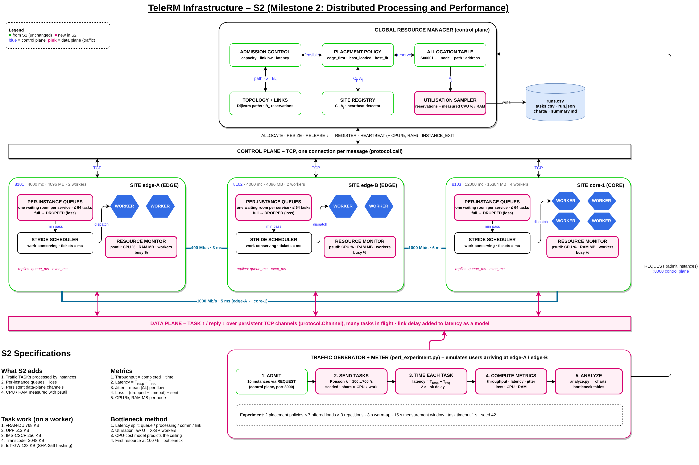
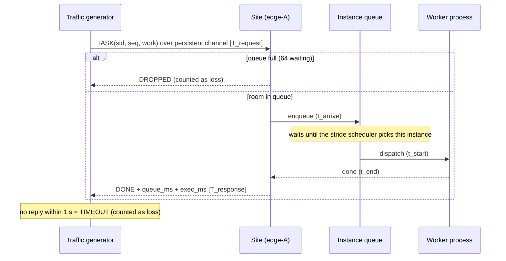
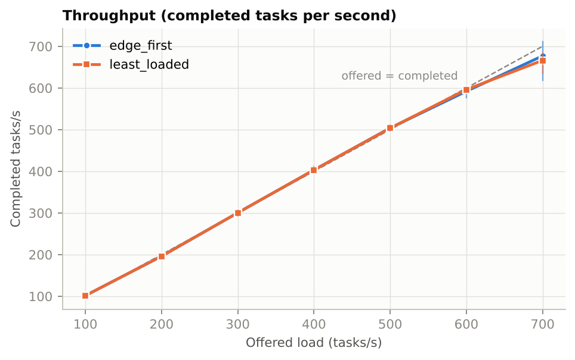
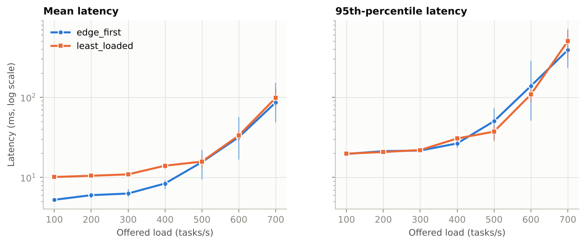
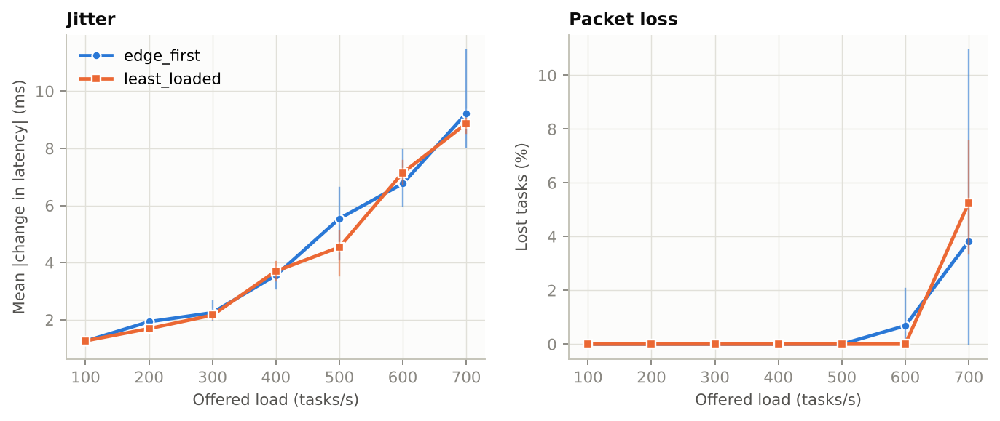
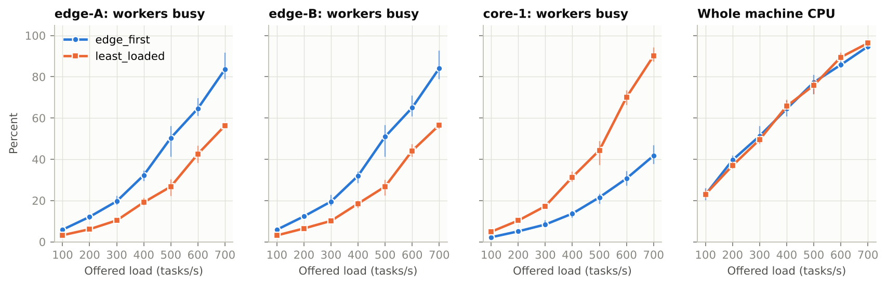
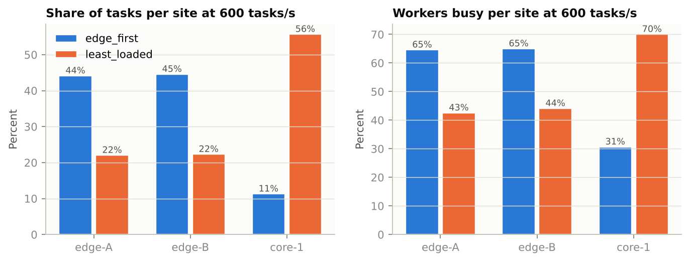
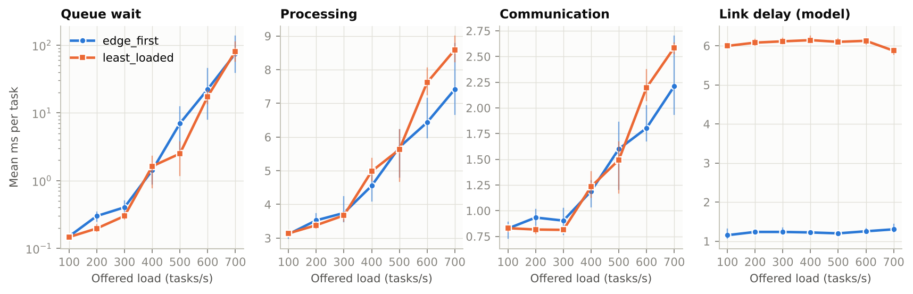

# Milestone 2 – Distributed Processing and Performance
**Theme 3: Distributed Telecom Resource Management System (TeleRM)**
ICS 2403 – Distributed Computing & Applications · Week 2 · System version S2 (evolved from S1)

---

## 0. The short version

In Milestone 1 the referral desk (the resource manager) decided which hospital (site) each
patient (service instance) goes to, and booked doctors' time for it. Nobody checked how
fast the hospitals actually treat people.

In Milestone 2 the patients start **bringing real work**. Each admitted service now
receives a steady stream of small jobs ("traffic tasks"), the sites process them on their
worker processes, and we **time everything**:

- how many tasks per second get done (**throughput**),
- how long each task takes from sending to answer (**latency**),
- how much that time varies (**jitter**),
- how many tasks never come back (**packet loss**),
- how hard each computer works (**CPU and memory**).

We then turn the traffic up step by step until the system can't keep up. That shows
**where the work went** (load-distribution analysis) and **what ran out first**
(bottleneck analysis).

**Headline results (2-core test machine, 42 runs):**

- **Capacity.** The system kept up with demand up to about **600 tasks/s**, and peaked at
  about **670 tasks/s**.
- **Delay.** Latency stayed around 5–15 ms up to 500 tasks/s, then rose steeply. Mean
  latency reached about 90 ms and p95 about 400–500 ms at 700 tasks/s, where 4–5 % of tasks
  were lost.
- **The bottleneck** was the machine's two CPU cores, shared by all 13 processes. A simple
  CPU-cost model fitted to the measurements predicts a ceiling of **674 tasks/s**.
- **Load distribution.** `edge_first` sent 89 % of tasks to the two small edge sites and
  gave the lowest delay at light load. `least_loaded` spread work more evenly (56 % on
  core-1) and gave lower tail latency and no loss at 500–600 tasks/s. On one machine,
  neither policy can add capacity.

## 1. What changed from S1 to S2

The brief requires one system that keeps growing, so S2 is S1 plus new parts. The S1
admission demo (`run_demo.py`) still runs unchanged.

| Part | S1 (Week 1) | S2 (Week 2) |
|---|---|---|
| Work done by a service instance | Synthetic: always busy, no requests | Real traffic tasks arriving at random; idle when there is no traffic |
| Site scheduler | Stride scheduling over always-busy instances | Same stride rules, now **work-conserving**: only instances with waiting tasks compete |
| Queues | None | One bounded queue (64 tasks) per instance; a full queue **drops** new tasks, which counts as packet loss |
| Communication | One TCP connection per message | Control plane unchanged; new **data plane** with persistent connections carrying many tasks at once |
| Measurement | Reservations, slot utilisation, fairness | Plus per-task timing (queue, processing, communication) and real CPU / memory via psutil on every node |
| Manager replies | Site name and path | Plus the site's **address**, so traffic can go straight to it |
| Experiments | Blocking probability under random arrivals | Offered-load sweep × placement policy, 3 repetitions |

New and changed files: `telerm/monitor.py` (new), `perf_experiment.py` (new), `analyze.py`
(new), `telerm/protocol.py`, `telerm/site.py`, `telerm/scheduler.py`, `telerm/process.py`
and `telerm/manager.py` (extended), plus the `perf` section in `config.json`.

## 2. Distributed processing implementation


*Figure 1. TeleRM S2 architecture (editable: TeleRM_S2_Architecture.drawio). Green parts come from S1, pink parts are new in S2.*

### 2.1 Control plane and data plane

S2 separates two kinds of communication. Real networks and controllers work the same way
(an SDN controller does not touch every packet).

| | Control plane | Data plane |
|---|---|---|
| Purpose | Decide and set up: admit, place, book, release | Do the actual work: carry and process traffic tasks |
| Who talks | Generator ↔ manager, manager ↔ sites | Generator ↔ sites, **directly** |
| How often | Rarely (10 admissions per run) | Hundreds of messages per second |
| Connection | New TCP connection per message (`protocol.call`) | One persistent TCP connection per site, many tasks in flight (`protocol.Channel`) |

The manager is **not** on the path of every task. It hands out the site address once at
admission, then steps aside. That keeps it from becoming the bottleneck, and section 7
confirms it: the manager used under 1 % CPU at every load.

In hospital terms: the referral desk sends you to a hospital once; after that you go to
the hospital directly for every appointment.

### 2.2 How one task is processed



The site measures two durations with its own clock: **queue time** (t_start − t_arrive)
and **processing time** (t_end − t_start). The generator measures the whole round trip
with its own clock. Each duration is measured on a single machine, so the nodes never
need synchronised clocks. Week 4 deals with clocks across machines.

### 2.3 How the computation is distributed

Work is spread across nodes at **three levels**:

1. **Across sites (placement).** The manager places the 10 instances on edge-A, edge-B and
   core-1 using the placement policy. A site only does the work of the instances it hosts.
2. **Across instances on a site (stride scheduling).** When several instances have tasks
   waiting, each gets worker turns in proportion to the CPU it booked.
3. **Across worker processes (parallelism).** Each site runs its tasks on 2 (edge) or 4
   (core) worker OS processes at the same time. An instance may use at most
   ⌈booked millicores ÷ 1000⌉ workers at once.

### 2.4 The workload

| Service | Instances (ingress) | Booked CPU | Work per task | Typical processing time* |
|---|---|---|---|---|
| vRAN-DU | 2 (edge-A, edge-B) | 1500 mc | 768 KB | 2.66 ms |
| UPF | 2 | 1000 mc | 512 KB | 1.31 ms |
| IMS-CSCF | 2 | 500 mc | 256 KB | 0.64 ms |
| Transcoder | 2 | 2000 mc | 2048 KB | 5.36 ms |
| IoT-GW | 2 | 250 mc | 128 KB | 0.32 ms |

\*Measured alone on the test machine, without contention.

- **The work itself.** A task's "work" is SHA-256 hashing of that many kilobytes inside a
  worker process. It is real CPU work standing in for packet processing or transcoding.
- **Arrivals.** Tasks arrive as a **Poisson process**: random, independent arrivals at an
  average rate λ (the *offered load*).
- **Which instance gets each task.** Each task picks an instance with probability
  proportional to *booked CPU ÷ work per task*. So each instance's CPU load matches what it
  booked, the way an operator sizes services for their expected traffic.
- **Reproducibility.** Everything is seeded (seed 42, plus the load and repetition number).

## 3. How each metric is measured

| Metric | Definition (brief) | How TeleRM measures it | Where |
|---|---|---|---|
| **Throughput** | Completed work ÷ time | Tasks answered DONE during the 15 s window ÷ 15 s | Generator |
| **Latency** | T_response − T_request | Per task, monotonic clock at the generator, **plus 2 × the one-way link delay** of the path (model, see below) | Generator |
| **Jitter** | Variation of latency | Mean \|L_i − L_(i−1)\| between consecutive tasks of the same instance (the idea behind RFC 3550 jitter, unsmoothed). Also p95 − p50 spread | Generator |
| **Packet loss** | Lost ÷ sent | (DROPPED by a full queue + TIMEOUT after 1 s + errors) ÷ tasks sent in the window | Generator and site |
| **CPU utilisation** | – | psutil, every second, per node: CPU % of the node process + its workers (100 % = one core). Also **workers busy %** = time workers spent processing ÷ (workers × time), and whole-machine CPU % | Each node → manager |
| **Memory utilisation** | – | psutil resident memory (RSS, MB) of each node and its workers; whole-machine memory % | Each node → manager |

**Latency breakdown.** For every task:

$$\text{measured latency} = \underbrace{\text{queue}}_{\text{site}} + \underbrace{\text{processing}}_{\text{site}} + \underbrace{\text{communication}}_{\text{the rest}}$$

$$\text{end-to-end latency} = \text{measured latency} + 2 \times \text{one-way link delay}$$

"Communication" covers everything outside the site's queue and workers: TCP, JSON
encoding, and time the generator's and site's event loops spend before getting to the
message.

**Why the link delay is modelled.** All nodes run on one machine in our runs, so the real
network delay is close to zero. A task for an instance hosted on core-1 that arrives at
edge-A would, in reality, cross the 5 ms edge-A ↔ core-1 link twice. We add that from the
configured topology. Tasks served at their own ingress edge add 0 ms. This is stated as a
model, not a measurement. On separate machines, the real network delay is measured inside
"communication" as well.

**Measurement window.** Each run has a 3 s warm-up (discarded), a 15 s measurement window,
then 2 s for late replies. Only tasks sent in the window count.

## 4. Experiment

### 4.1 Hypotheses

- **H1 (performance vs load).** As offered load rises, throughput rises in step with it
  until the system saturates. Past that point, throughput levels off, while latency, jitter
  and loss rise sharply.
- **H2 (load distribution).** `edge_first` puts most traffic on the two small edge sites, so
  they saturate first. `least_loaded` spreads work over all three sites, which gives lower
  queueing and loss near saturation, even though core-hosted tasks pay extra link delay.

### 4.2 Variables

| Type | Variables |
|---|---|
| **Independent** | Offered load λ ∈ {100, 200, 300, 400, 500, 600, 700} tasks/s; placement policy ∈ {edge_first, least_loaded} |
| **Dependent** | Throughput, latency (mean, p50, p95, p99), jitter, loss %, CPU % and memory per node, workers busy %, latency breakdown |
| **Controlled** | Hardware, OS, Python version, the 10-instance set, task work sizes, traffic split, queue limit 64, timeout 1 s, window lengths, seed, site capacities and worker counts, topology |

### 4.3 Design

2 policies × 7 loads × 3 repetitions = **42 runs**. Every run starts all four nodes fresh,
so no state carries over. Repetitions use different seeds, and charts show the mean with a
min–max bar across repetitions.

### 4.4 Test environment

| Item | Value |
|---|---|
| Hardware | Cloud VM, 2 vCPU (x86_64), 7.8 GB RAM. **All nodes, all 8 workers and the generator share these 2 cores** |
| Operating system | Ubuntu 24.04.5 LTS (Linux 6.18) |
| Language and libraries | Python 3.13.15, psutil 7.2.2, matplotlib 3.11 (charts only) |
| Network | Loopback on one machine; inter-site link delays modelled from `config.json` |
| Configuration | `config.json` (copied with hardware details into `results/M2-load-sweep/config_used.json`) |
| Workload | Section 2.4; arrival seed = 42 × 1000 + load × 10 + repetition |
| Command | `python perf_experiment.py --out results/M2-load-sweep` then `python analyze.py results/M2-load-sweep` |
| Raw data | `runs.csv` (42 rows) and `tasks.csv` per run (every task, about 1 800–12 600 rows each) |

**Repeat on your own laptops.** Your numbers will differ: more cores mean a higher
ceiling. The method, the shape of the curves and the bottleneck reasoning carry over.
Change `offered_loads` so the sweep crosses your machine's saturation point.

## 5. Results

All figures show the mean of 3 repetitions. The thin vertical bars show the lowest and
highest repetition. Blue is always `edge_first`; orange is always `least_loaded`.

### 5.1 Throughput



| Offered (tasks/s) | 100 | 200 | 300 | 400 | 500 | 600 | 700 |
|---|---|---|---|---|---|---|---|
| edge_first throughput | 101.6 | 196.2 | 300.4 | 403.1 | 503.9 | 592.0 | 677.0 (618–712) |
| least_loaded throughput | 101.6 | 196.1 | 300.4 | 403.3 | 503.5 | 596.2 | 666.2 (635–684) |

Throughput equals offered load up to 500 tasks/s. At 600 it still matches the rate
actually sent in five of six runs; the exception is one edge_first run that lost 2 %. At
700 it falls 3–5 % short: the system can no longer finish work as fast as it arrives.

### 5.2 Latency



| Offered (tasks/s) | 100 | 200 | 300 | 400 | 500 | 600 | 700 |
|---|---|---|---|---|---|---|---|
| edge_first mean (ms) | 5.3 | 6.0 | 6.3 | 8.4 | 15.5 | 31.7 | 86.0 |
| least_loaded mean (ms) | 10.1 | 10.5 | 10.9 | 14.0 | 15.7 | 33.3 | 97.9 |
| edge_first p95 (ms) | 19.6 | 21.2 | 21.6 | 26.5 | 50.2 | 137.8 | 387.2 |
| least_loaded p95 (ms) | 19.8 | 20.7 | 21.9 | 30.6 | 37.2 | 108.1 | 499.5 |

Latency is flat at light load, then grows steeply from about 400–500 tasks/s; note the log
scale. The two policies' p95 is the same at light load (about 20 ms). That is because the
slowest tasks are the transcoder tasks, which run on core-1 under both policies and pay the
link delay.

### 5.3 Jitter and packet loss



| Offered (tasks/s) | 100 | 200 | 300 | 400 | 500 | 600 | 700 |
|---|---|---|---|---|---|---|---|
| edge_first jitter (ms) | 1.26 | 1.93 | 2.25 | 3.56 | 5.54 | 6.77 | 9.22 |
| least_loaded jitter (ms) | 1.27 | 1.69 | 2.16 | 3.70 | 4.54 | 7.15 | 8.86 |
| edge_first loss (%) | 0 | 0 | 0 | 0 | 0 | 0.68 (0–2.05) | 3.82 (0–10.94) |
| least_loaded loss (%) | 0 | 0 | 0 | 0 | 0 | 0 | 5.24 (3.35–7.55) |

- **Jitter** grows steadily with load, roughly 7× from 100 to 700 tasks/s, because queue
  lengths change more and more from one task to the next.
- **Loss** appears only near saturation. About half of the lost tasks were dropped by full
  queues; the other half timed out after 1 s.
- **Repetitions disagree near saturation.** At 700 tasks/s, edge_first lost 0 %, 0.5 % and
  10.9 % in its three repetitions. Section 8 explains why.

### 5.4 CPU and memory



| Policy, offered | edge-A busy / CPU | edge-B busy / CPU | core-1 busy / CPU | Machine CPU | Manager CPU | Generator CPU |
|---|---|---|---|---|---|---|
| edge_first, 100 | 6 % / 13 % | 6 % / 13 % | 2 % / 9 % | 23 % | 0.5 % | 5 % |
| edge_first, 500 | 50 % / 48 % | 51 % / 47 % | 22 % / 39 % | 77 % | 0.5 % | 13 % |
| edge_first, 700 | 84 % / 58 % | 84 % / 57 % | 42 % / 53 % | 95 % | 0.6 % | 14 % |
| least_loaded, 100 | 3 % / 7 % | 3 % / 7 % | 5 % / 20 % | 23 % | 0.6 % | 5 % |
| least_loaded, 500 | 27 % / 27 % | 27 % / 27 % | 44 % / 81 % | 76 % | 0.5 % | 12 % |
| least_loaded, 700 | 56 % / 34 % | 57 % / 35 % | 90 % / 104 % | 96 % | 0.5 % | 14 % |

"Busy" means the share of time a site's workers were processing tasks. "CPU" is the
psutil reading for the node plus its workers, where 100 % = one core. Machine CPU is the
whole 2-core VM.

**Memory** stayed constant at every load: about 96 MB per edge site, 167 MB for core-1
(which has more workers), and about 10 % of the VM's RAM in total. Each worker holds a
fixed 16 MB work buffer and tasks are processed one at a time, so memory does not grow with
traffic. Memory is not a constraint in S2.

## 6. Load-distribution analysis



At 600 tasks/s, the highest load where both policies lost under 1 %:

| Policy | edge-A: instances / task share / workers busy | edge-B | core-1 | Balance (Jain, workers busy) |
|---|---|---|---|---|
| edge_first | 4 / 44 % / 65 % | 4 / 45 % / 65 % | 2 / 11 % / 31 % | 0.916 |
| least_loaded | 2 / 22 % / 43 % | 2 / 22 % / 44 % | 6 / 56 % / 70 % | 0.944 |

**What happened:**

1. **edge_first keeps work at the edge.** Every instance that fits stays at its ingress
   edge, so 8 of 10 instances and 89 % of tasks ran on the two smallest sites. Only the
   transcoders (too big to fit beside the others) went to core-1, which used just 31 % of
   its workers.
2. **least_loaded moves work to the big site.** It placed 6 of 10 instances on core-1
   (UPF, IMS and transcoders). The vRAN-DUs and IoT gateways stayed at the edges. The DUs
   had to, because of their 2 ms bound. The IoT gateways arrived last, when core-1 was
   already proportionally fuller than the edges, so least_loaded picked an edge. Utilisation
   across sites is more even (Jain 0.944 vs 0.916).
3. **The trade-off is latency against headroom.**
   - **Light load (100–300 tasks/s):** edge_first's mean latency is about half that of
     least_loaded (5.3 vs 10.1 ms; median 3.4 vs 12.5 ms). Tasks served at their own
     ingress edge never cross a link, while least_loaded adds 5–6 ms each way for
     core-hosted tasks (the "Link delay" panel in section 7).
   - **Near saturation (500–600 tasks/s):** least_loaded is better at the tail (p95 37 vs
     50 ms at 500; 108 vs 138 ms at 600). It also lost nothing at 600 in all three
     repetitions, while edge_first lost 2 % in one. The small edge sites fill their queues
     first.
4. **On one machine, placement cannot add capacity.** Both policies hit the same ceiling
   (666–677 tasks/s), because all three sites share the same 2 CPU cores. Placement only
   decides *which* queues fill first, not how much total work the hardware can do.

**Hypothesis H2 is partly supported.** least_loaded does balance load better and protects
the tail near saturation. But it costs latency at light load, and it does not raise
throughput when all sites share one machine.

**Prediction to test in Week 3, on three laptops** (`--no-launch`). With each site on its
own CPU, edge_first should saturate when the two edge laptops are full, while core-1 sits
mostly idle. least_loaded should then reach clearly higher throughput. That makes an
edge-aware placement that keeps latency-critical traffic local and pushes tolerant traffic
to the core a strong Week 12 improvement candidate, and it matches the Week 1 blocking
finding.

## 7. Bottleneck analysis



### 7.1 Where the time goes

| edge_first, offered | Queue | Processing | Communication | Link (model) | Total mean |
|---|---|---|---|---|---|
| 100 tasks/s | 0.15 ms | 3.12 ms | 0.83 ms | 1.15 ms | 5.25 ms |
| 400 tasks/s | 1.42 ms | 4.55 ms | 1.19 ms | 1.22 ms | 8.39 ms |
| 600 tasks/s | 22.24 ms | 6.43 ms | 1.80 ms | 1.25 ms | 31.73 ms |
| 700 tasks/s | 75.06 ms | 7.42 ms | 2.21 ms | 1.30 ms | 85.98 ms |

(least_loaded shows the same pattern; see `summary.md`.)

Two signs point to the same cause:

- **Queue time explodes.** It goes from 0.15 ms to 75 ms and makes up 87 % of latency at
  700 tasks/s. Work is arriving faster than it can be served.
- **Processing time grows even though the work does not.** Every task does exactly the
  same hashing at every load, yet its processing time more than doubles (3.1 → 7.4–8.6 ms).
  The only explanation is that each worker gets less CPU per second: the processors are
  shared and contended.

Communication grows only from 0.8 to 2.6 ms, and the modelled link delay is constant. The
network path is not the bottleneck.

### 7.2 Which resource ran out first

| Resource | Highest value seen | At 100 %? |
|---|---|---|
| **Whole-machine CPU (2 cores)** | **95–96 %** at 700 tasks/s | **Yes — the bottleneck** |
| Workers of the busiest site | 84 % (edge sites, edge_first); 90 % (core-1, least_loaded) | No |
| Manager CPU | 0.5–0.6 % at every load | No |
| Generator CPU | ≤ 16 % of one core | No |
| Memory | Constant, about 10 % of RAM | No |
| Data-plane connections | 3 persistent connections, communication ≤ 2.6 ms | No |

No site's workers reached 100 %, yet tasks queued anyway. With 8 workers plus 4 node
processes plus the generator on 2 cores, workers are often *ready* to run but waiting for a
core. The shared physical CPU saturates before any single site does.

### 7.3 A simple model that predicts the ceiling

If CPU is the bottleneck, machine CPU should grow in a straight line with throughput. A
least-squares fit over the 30 runs below saturation (100–500 tasks/s, both policies) gives:

$$\text{cores used} = 0.216 + 2.647\ \text{ms} \times X \qquad (R^2 = 0.979)$$

where X is throughput in tasks/s. So:

- **Fixed cost:** 0.216 cores are used regardless of traffic, by heartbeats, scheduler
  loops, sampling and the OS.
- **Per-task cost:** each task costs 2.65 ms of CPU in total.
- **Useful share:** of that 2.65 ms, the actual service work (hashing) is 1.69 ms on
  average, which is 64 %. The other 36 % is overhead: handing the task to a worker
  process, JSON encoding, the event loops and TCP.

Setting cores used = 2 gives the predicted maximum throughput:

$$X_{max} = \frac{2 - 0.216}{0.002647} \approx 674\ \text{tasks/s}$$

The measured peak was **666–677 tasks/s**. A model built only from below-saturation data
predicts the ceiling within 1 %, which is strong evidence that CPU is the bottleneck.

### 7.4 Cross-check: the utilisation law

The utilisation law, U = X × S ÷ (number of workers), says how busy a site's workers should
be, given its throughput X and mean processing time S. At 600 tasks/s:

| Policy | Site | X (tasks/s) | S (ms) | Predicted U | Measured busy |
|---|---|---|---|---|---|
| edge_first | edge-A | 260.0 | 4.98 | 64.7 % | 64.6 % |
| edge_first | core-1 | 67.4 | 18.09 | 30.5 % | 30.7 % |
| least_loaded | core-1 | 331.6 | 8.45 | 70.1 % | 70.0 % |

Prediction and measurement agree within 0.3 percentage points for every site (full table in
`summary.md`). This shows the measurement pipeline is internally consistent: three
independent measurements (task counts at the generator, processing times at the site, busy
time from the scheduler) agree with each other.

### 7.5 Ranked bottlenecks and what fixes them

1. **Shared physical CPU (now).** Fix: give each site its own machine. That is the point of
   distributing, and the Week 3 test.
2. **Per-task overhead, 36 % of CPU (next).** Fixes: batch several tasks per message,
   reduce the hand-off cost to workers, or use a faster encoding than JSON. Each is a
   candidate for the "reduced communication overhead" improvement.
3. **Small edge sites under edge_first (on separate machines).** With 2 workers each, the
   edges will saturate long before core-1. Fix: latency-aware placement that moves tolerant
   services to the core.

## 8. Failure-driven engineering log – Week 2

> **Group note:** these are real issues from building and running S2 on the test machine.
> Keep them only if you reproduce them, and add your own from your laptops.

| | Entry 1 | Entry 2 | Entry 3 | Entry 4 |
|---|---|---|---|---|
| **What changed?** | Instances changed from always-busy (S1) to traffic-driven | First sweep runs at 600–700 tasks/s | First measurements of processing time under load | Added `--no-launch` for multi-machine runs |
| **What failed?** | Design review: an instance idle for a while would come back with a very old, small stride "pass" value and grab every worker until it caught up | Repetitions disagreed wildly near saturation: edge_first at 700 lost 0 %, 0.5 % and 10.9 % | Processing time per task doubled (3.1 → 7.4 ms) even though every task does identical work | Code review: the clean-up code in `finally` contained a `return`, which would have silently discarded every result in that mode |
| **Why did it fail?** | Stride scheduling assumes every client is always runnable. Idle time was being counted as "credit" | At ~95 % CPU, a short random burst of Poisson arrivals fills queues faster than they drain; the run's outcome depends on when bursts happen | All workers and nodes share 2 cores. "Processing time" includes waiting for a core, not just doing the work | In Python, a `return` inside `finally` replaces the function's return value |
| **How was it fixed?** | On wake-up, the instance's pass is raised to the current minimum pass (no back pay) | Charts and tables report min–max across repetitions; conclusions avoid single runs near the knee | Treated as a symptom and used in the bottleneck analysis (section 7); the CPU-cost model separates useful work from overhead | Restructured so clean-up never returns; the result is returned from the main body |
| **Alternative considered** | Reset pass to 0 for everyone when any instance wakes (simpler, but unfair to busy instances) | Longer windows and 5+ repetitions near saturation (better, but doubles run time) | Pin workers to cores with CPU affinity (not portable to Windows) | Separate script for multi-machine runs (duplicated code) |
| **What was learned?** | An algorithm's assumptions (always busy) must be rechecked when the workload changes | Near saturation, a system is unstable; one run proves nothing | On shared hardware, measured service time depends on load, so the resource doing the work must be identified before blaming the software | Clean-up code needs the same review as main logic |

## 9. Reproducibility record

Everything needed to rerun this experiment is listed in section 4.4. A second group can
reproduce the results with:

```bash
pip install -r requirements.txt
python perf_experiment.py --out results/M2-repeat
python analyze.py results/M2-repeat
```

Same machine type plus the same seed gives the same arrivals and placements. Timing results
depend on the hardware, so compare curve shapes and the bottleneck, not exact milliseconds.

## 10. Limitations and next steps

- **One machine.** All sites shared 2 cores, so the experiment shows how work is
  *distributed* but not the extra *capacity* that real distribution brings. Next: repeat
  across three laptops with `--no-launch` (Week 3 architecture).
- **Modelled link delay.** On one machine the edge ↔ core delays are added from the
  topology, not measured. On separate machines the real network delay will appear in
  "communication".
- **Link bandwidth is reserved but not consumed.** Tasks are small messages, so the
  bandwidth booked in S1 does not yet limit traffic.
- **Synthetic work.** Hashing stands in for packet processing; real network functions have
  different memory and I/O behaviour.
- **Manager is still a single point of failure.** It is idle during traffic thanks to the
  control/data split, but admission stops if it fails (Weeks 4 and 7).

**S2 is the performance baseline.** Every later improvement (Week 12) will be compared
against these curves on the same workload.

