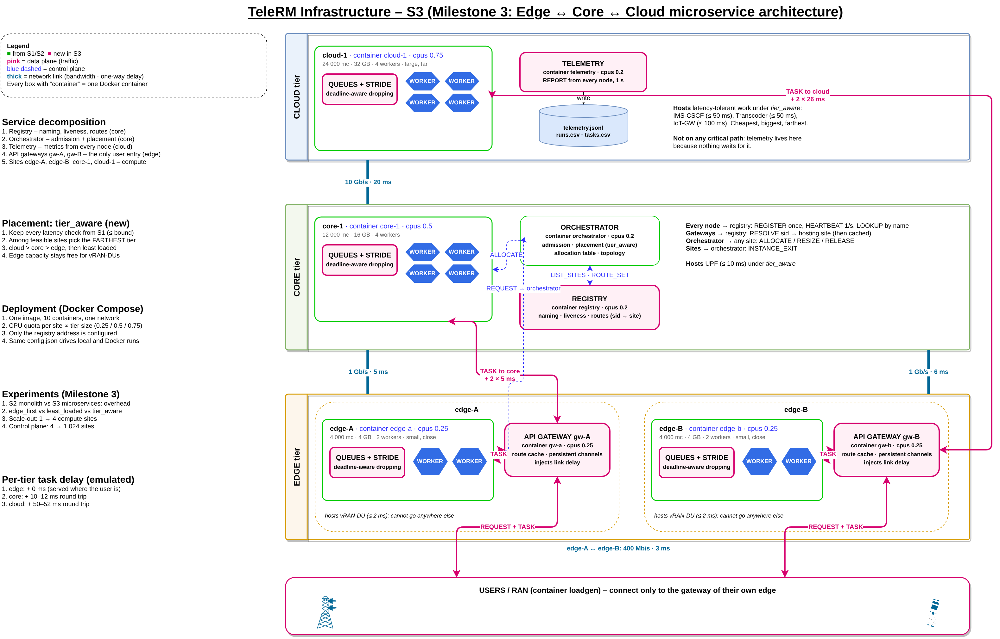
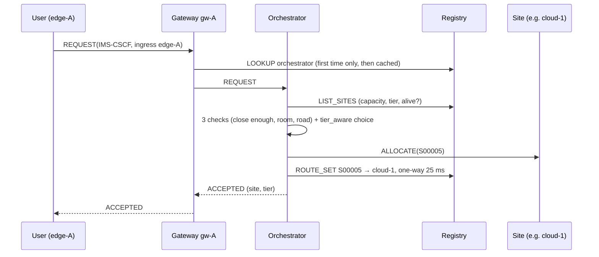
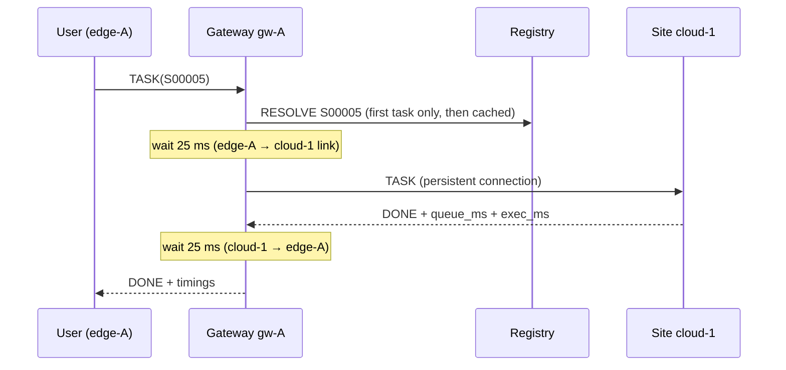
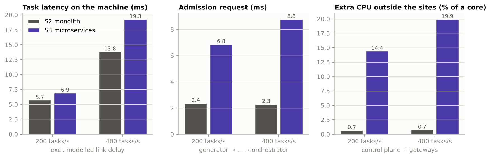
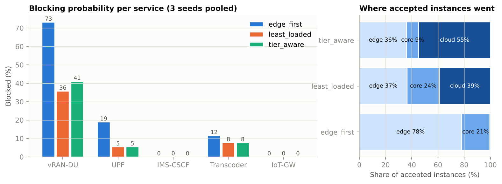
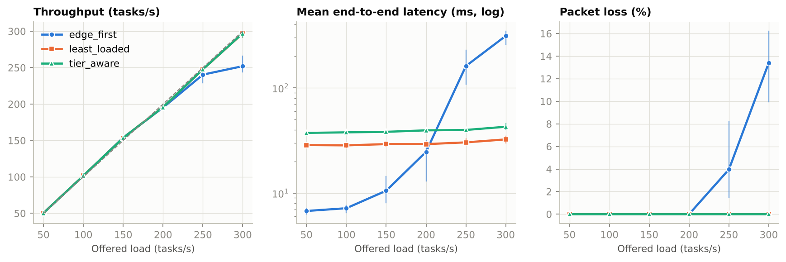
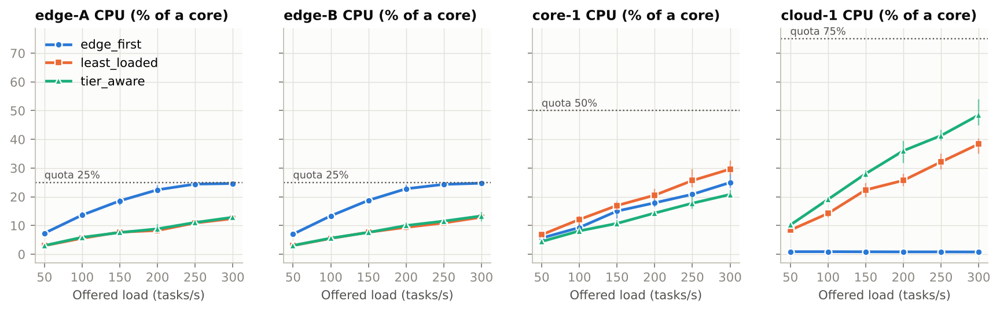
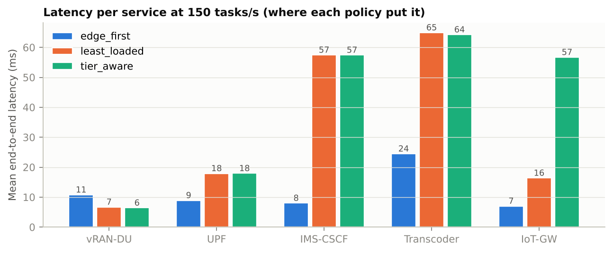
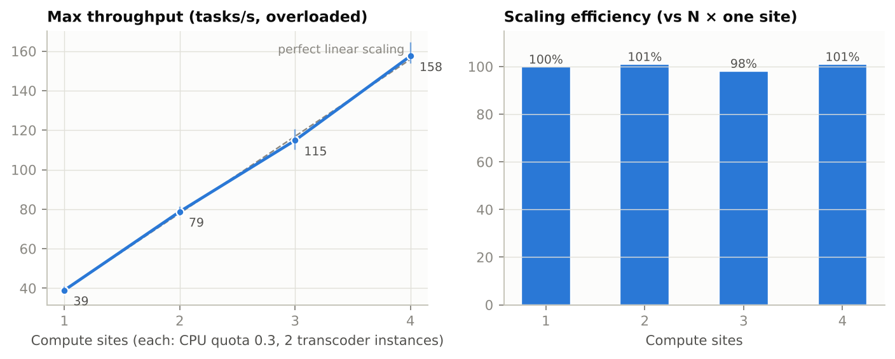
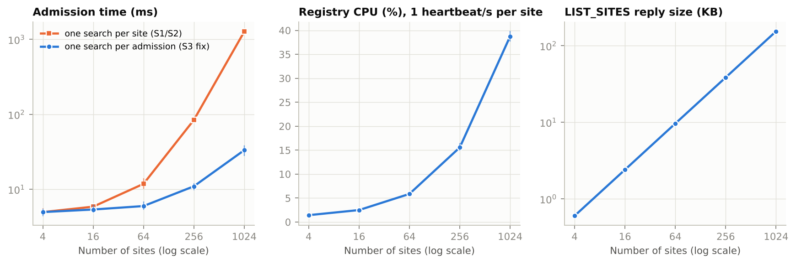

# Milestone 3 – Distributed Architecture
**Theme 3: Distributed Telecom Resource Management System (TeleRM)**
ICS 2403 – Distributed Computing & Applications · Week 3 · System version S3 (evolved from S2)

---

## 0. The short version

Until now TeleRM had one "brain": the manager. It knew every site, admitted every request,
stored every measurement, and the generator had to know every site's address. That is a
**client-server** system. It works, but everything depends on one program, and every
client must know where everything is.

In Milestone 3 we turned it into a **multi-tier, microservice architecture** that spans
**edge ↔ core ↔ cloud**:

- **A cloud tier.** A third kind of site: very large, but far away (20 ms beyond the core).
- **The manager is split into separate services**, each in its own container:
  - **registry:** the phone book. Who exists, who is alive, where each service instance runs.
  - **orchestrator:** the old admission and placement logic.
  - **telemetry:** collects every measurement.
  - **API gateways at each edge:** the only door users ever knock on.
- **A new placement rule, `tier_aware`.** Put each service as far from the user as its
  latency budget allows. Scarce edge capacity is then kept for the services that cannot go
  anywhere else (the vRAN-DUs).
- **A real deployment architecture.** One Docker image and ten containers. Each site gets a
  CPU quota proportional to its tier, so sites finally behave like separate machines.

In hospital terms: the single referral desk became a hospital network. Every town clinic
has a reception desk (gateway). A central records office (registry) knows where every
patient is being treated. The referral office (orchestrator) only decides placements. A
statistics office (telemetry) collects the numbers. A large national hospital (cloud) far
away takes the patients who can travel.

**What we found (details in section 7):**

| Question | Answer |
|---|---|
| What does the split cost? | Same throughput. +1.2 ms per task at 200 tasks/s, admission 2.4 → 6.9 ms, about 14 % of a core extra (mostly the gateways), RAM 23 → 114 MB |
| Which placement rule blocks least? | least_loaded 12.8 % and tier_aware 14.4 %, both far better than edge_first's 27.1 % |
| Edge vs core vs cloud? | edge_first is fastest (7 ms) until the edges hit their quota, then collapses at 250 tasks/s. least_loaded and tier_aware cost 29–40 ms but lose nothing up to 300 tasks/s. tier_aware leaves the edges half empty |
| Does adding sites add capacity? | Yes, almost perfectly: 39 → 79 → 115 → 158 tasks/s for 1 → 4 sites (98–101 % efficiency) |
| Where does the control plane break? | Admission time exploded with many sites (1.27 s at 1 024 sites). One fix brought it to 33 ms (≈ 38× faster). The registry then handles about 2 500 heartbeats/s per core |

## 1. What changed from S2 to S3

| Part | S2 (Week 2) | S3 (Week 3) |
|---|---|---|
| Tiers | edge-A, edge-B, core-1 | **+ cloud-1** (24 000 mc, 32 GB; core ↔ cloud 10 Gb/s, 20 ms) |
| Control plane | One manager process does everything | **registry + orchestrator + telemetry**, three services |
| Entry point for users | Generator sends to the manager and directly to sites (must know every address) | **Edge API gateways** gw-A, gw-B; users only know their own edge's gateway |
| Finding things | Addresses in config.json | **By name through the registry**; only the registry address is configured |
| Site liveness | Heartbeats to the manager | Heartbeats to the registry |
| Measurements | Stored in the manager | Pushed to the telemetry service (cloud tier) |
| Link delay | Added to latency as a model | **Really experienced**: the gateway waits the edge → host delay each way |
| Placement | edge_first, least_loaded, best_fit | **+ tier_aware** |
| Overload behaviour | Sites process every queued task | **Deadline-aware dropping**: tasks older than their deadline are discarded before using CPU |
| Path search | One shortest-path search per candidate site | **One search per admission** (≈ 7.7× faster at 256 sites, ≈ 38× at 1 024) |
| Deployment | Local processes | Local processes **or Docker Compose** (one container per service, CPU quotas) |

The S1 and S2 programs still run unchanged (`run_demo.py`, `perf_experiment.py --config
config_m2.json`). Without `--registry`, the manager and sites behave exactly as before.
That is what makes the S2-versus-S3 comparison in section 7 possible.

## 2. Evaluating the four architecture styles

The brief asks us to evaluate four styles. Here is what each would mean for TeleRM, and
which parts we took.

### 2.1 What each style is

| Style | Idea | What it would mean in TeleRM |
|---|---|---|
| **Client-server** | One server holds the logic and state; clients send requests to it | S1/S2: the manager is the server; sites and the generator are its clients |
| **Multi-tier (n-tier)** | Split by layer: entry/presentation → logic → data, each tier on its own machines; physically, tiers can also be *places* (edge, core, cloud) | Gateways (entry) → orchestrator (logic) → registry and telemetry (state). Physically: edge → core → cloud |
| **Service-oriented (SOA)** | Coarse-grained services with published contracts, found through a shared service registry, often joined by a central bus | Admission, naming and monitoring become services with message contracts, discovered through the registry |
| **Microservices** | Small services, each deployed independently in its own container, each owning its own data, talking over lightweight protocols, usually behind an API gateway; each can be scaled on its own | Each service is its own container and owns its own state: the registry owns names and routes, the orchestrator owns allocations, telemetry owns metrics. Users enter through gateways; more gateways or sites are added independently |

### 2.2 Comparison for this system

| Criterion | Client-server (S2) | Multi-tier | SOA | Microservices (S3) |
|---|---|---|---|---|
| Simplicity | **Best**: one place to look | Good | Medium | Most moving parts (10 containers) |
| Latency per request | **Lowest**: one hop | One extra hop per tier | Extra hops via the bus | One extra hop at the gateway (measured: about 1–3 ms per task, section 7.1) |
| Single point of failure | The manager stops everything | Each tier is one | The bus, the registry | The registry and orchestrator still are; Weeks 4 and 7 replicate them |
| Scaling the parts that are busy | Only by a bigger server | Per tier | Per service | **Per service**: more gateways with more edges, more sites, independently |
| Fault isolation | None: one crash stops all | Per tier | Per service | Per container: a telemetry crash does not stop traffic |
| Location transparency | None: clients know every address | Partial | Through the registry | **Full for users**: they only know their gateway |
| Fit with telecom practice | – | Matches edge/core/cloud sites | The 5G core is a *service-based architecture* | 5G core network functions are separately deployed services, found through a repository function (the NRF, 3GPP TS 23.501). Our registry plays that role |

### 2.3 Our choice

TeleRM S3 is a **microservice control plane deployed over a three-tier physical topology
(edge, core, cloud)**. This combines two of the styles:

- **Microservices for the software:** independent deployment and scaling, failures isolated
  per service, and users who need no knowledge of where things run.
- **Multi-tier for placement:** work goes to the tier whose latency and capacity fit it.

The price is more hops and more processes. We measured that price (section 7) instead of
assuming it. We did *not* add an enterprise service bus (classic SOA): with only five
service types, direct messages are simpler and faster.

## 3. Architectural design


*Figure 1. TeleRM S3 (editable: TeleRM_S3_Architecture.drawio). Pink = data plane, blue
dashed = control plane, thick lines = network links with bandwidth and one-way delay.*

### 3.1 Tiers

| Tier | Sites | Capacity (each) | One-way delay from an edge | Role |
|---|---|---|---|---|
| Edge | edge-A, edge-B | 4 000 mc, 4 GB, 2 workers | 0 ms (own edge), 3 ms (other edge) | Close to users, small, scarce. Hosts what *must* be close |
| Core | core-1 | 12 000 mc, 16 GB, 4 workers | 5–6 ms | Regional data centre. Medium delay, medium size |
| Cloud | cloud-1 | 24 000 mc, 32 GB, 4 workers | 25–26 ms | Large and cheap, but far. Hosts what can wait |

### 3.2 Two kinds of traffic

- **Control plane (blue).** Rare messages that set things up: register, heartbeat, admit,
  place, allocate, look up.
- **Data plane (pink).** The actual work: traffic tasks from users to the site hosting their
  service. It goes user → own edge's gateway → hosting site, and the manager/orchestrator
  is never on this path.

### 3.3 How one admission works in S3



### 3.4 How one traffic task works in S3



## 4. Service decomposition

### 4.1 The services

| Service | Container | Tier | Owns (its own data) | Messages it serves | Why separate |
|---|---|---|---|---|---|
| **Registry** | registry (0.2 CPU) | core | Node list (name, address, tier, capacity, liveness); routes (instance → site) | REGISTER, HEARTBEAT, LOOKUP, LIST_SITES, ROUTE_SET, ROUTE_DEL, RESOLVE | Naming and liveness are needed by everyone; admission is not |
| **Orchestrator** | orchestrator (0.2 CPU) | core | Allocation table, topology and link reservations, placement policy | REQUEST, RESIZE, INSTANCE_EXIT | The decision logic, kept small and focused |
| **Telemetry** | telemetry (0.2 CPU) | cloud | Time series from every node | REPORT, QUERY | High message rate, never on a critical path; can live far away |
| **API gateway** (one per edge) | gw-a, gw-b (0.25 CPU) | edge | Route cache, connections to sites | REQUEST, TASK | Single entry for users; scales with the number of edges; hides site locations |
| **Compute site** (one per site) | edge-a, edge-b, core-1, cloud-1 | its own | Running instances, queues, stride scheduler, workers | ALLOCATE, RESIZE, RELEASE, TASK | The actual compute |

### 4.2 Decomposition rules we followed

1. **Split by responsibility and by rate.**
   - Naming and liveness (~10 messages/s): registry.
   - Decisions (a few per second): orchestrator.
   - Measurements (~10 reports/s): telemetry.
   - Traffic (hundreds per second): gateways and sites.
2. **Each service owns its data.** No two services write the same table. The orchestrator
   *asks* the registry for sites instead of keeping its own copy.
3. **Only one address is configured: the registry's.** Every other address is looked up by
   name, which is the first step toward the transparency of Week 9.
4. **Nothing waits on telemetry.** Losing it loses graphs, not service, so it can sit in the
   cloud.

### 4.3 Message complexity per operation

| Operation | S2 monolith | S3 microservices |
|---|---|---|
| One admission | 2 round trips (generator → manager → ALLOCATE) | 5 round trips (→ gateway → orchestrator → LIST_SITES → ALLOCATE → ROUTE_SET), +1 LOOKUP the first time |
| One traffic task | 1 round trip (generator → site) | 2 round trips (generator → gateway → site), +1 RESOLVE for the first task per instance |
| Background, per second | N site heartbeats | 2N (heartbeat + report per site) + 2G (gateways) + 4 (orchestrator, telemetry, registry) |

N = number of sites, G = number of gateways. So S3 trades more messages for decoupling.
Section 7 measures what that costs.

## 5. Deployment architecture

### 5.1 One image, ten containers

```
docker-compose.yml   (generated:  python -m telerm.deploy compose)
 ├─ registry      cpus 0.20  mem 256 MB   python -m telerm.registry
 ├─ orchestrator  cpus 0.20  mem 256 MB   python -m telerm.manager --registry registry:8010 --policy $POLICY
 ├─ telemetry     cpus 0.20  mem 256 MB   python -m telerm.telemetry --registry registry:8010
 ├─ gw-a, gw-b    cpus 0.25  mem 256 MB   python -m telerm.gateway --location edge-A|edge-B --delay-mode emulate
 ├─ edge-a, edge-b cpus 0.25 mem 512 MB   python -m telerm.site --tier edge  --registry registry:8010
 ├─ core-1        cpus 0.50  mem 512 MB   python -m telerm.site --tier core  --registry registry:8010
 ├─ cloud-1       cpus 0.75  mem 512 MB   python -m telerm.site --tier cloud --registry registry:8010
 └─ loadgen       cpus 0.50               python m3_run.py traffic --deploy external   (run on demand)
```

- **One image.** All services share one image (`Dockerfile`, based on `python:3.12-slim`
  plus psutil). The command decides which service a container runs.
- **Names, not addresses.** Containers find each other through Docker's built-in name
  resolution (`registry:8010`). Sites register their container name as their host.
- **CPU quotas make sites independent.** In M2 all sites shared the same two cores, so
  placement could not add capacity. With quotas, each site has its own CPU budget,
  proportional to its tier. We verified that a quota gives proportional speed: 0.25, 0.5
  and 1.0 CPU gave 94, 177 and 364 hashes/s.
- **Link delay.** The test machine's kernel has no `netem` traffic-control module, so the
  gateways insert the one-way delay of the edge → host path in software, before forwarding
  a task and before returning its reply. Every task therefore really waits:
  - 0 ms extra at its own edge
  - 10–12 ms round trip to the core
  - 50–52 ms round trip to the cloud

  On a laptop with Docker Desktop, the same could be done with `tc netem` inside the
  containers. That would be the next step towards realism.
- **The same `config.json` drives both deployments.** `telerm/deploy.py` turns it into
  local processes or into the compose file, so they cannot drift apart.

### 5.2 How to run it

```bash
# containers (Docker Desktop on Windows/macOS, or Docker on Linux)
python -m telerm.deploy compose > docker-compose.yml
POLICY=tier_aware docker compose up -d --build
docker compose run --rm loadgen python m3_run.py traffic --arch s3 --deploy external \
       --registry registry:8010 --delay-mode emulate --policies tier_aware --loads 150
docker compose down

# or: all services as local processes, no Docker
python m3_run.py traffic --arch s3 --deploy local --policies tier_aware --loads 150
```

### 5.3 Mapping to real machines

| Container | Would run on |
|---|---|
| gw-a, edge-a | Server(s) in the edge site at cell-site cluster A |
| gw-b, edge-b | Server(s) in the edge site at cell-site cluster B |
| registry, orchestrator, core-1 | Regional (core) data centre |
| telemetry, cloud-1 | Public or private cloud region |

Because services only need the registry's address, moving a container to another machine
only changes the address in that one setting.

## 6. Edge vs core vs cloud: the placement rule

### 6.1 The question

The same service can usually run in several tiers. Running it **closer** to the user gives
lower delay but uses scarce, expensive edge capacity. Running it **farther away** costs
delay but uses plentiful, cheap capacity. Each service has a latency budget:

| Service | Budget (one-way) | Tiers that meet it (from edge-A) |
|---|---|---|
| vRAN-DU | 2 ms | edge-A only |
| UPF | 10 ms | edge-A, edge-B (3 ms), core (5 ms) |
| IMS-CSCF | 50 ms | all, cloud = 25 ms |
| Transcoder | 50 ms | all |
| IoT-GW | 100 ms | all |

### 6.2 The three policies compared

| Policy | Rule | Expected effect |
|---|---|---|
| edge_first | Ingress edge if possible, else the nearest site | Lowest delay for everyone while the edge has room; the edge fills fast; DUs then have nowhere to go |
| least_loaded | Emptiest site (by dominant share) | Spreads load; ignores what each service needs |
| **tier_aware** (new) | Farthest tier that still meets the budget, then least loaded within it | DUs at the edge, UPF in the core, the rest in the cloud. Keeps the edge free; tolerant services pay extra delay they can afford |

In hospital terms, tier_aware sends patients who can travel to the big national hospital,
so the small town clinic always has a bed for the emergency that cannot travel.

## 7. Experiments

All experiments follow hypothesis → design → implementation → measurement → analysis →
conclusion.

### 7.0 Test bed and fairness rules

- **Machine:** one cloud VM, 2 vCPU, 7.8 GB RAM, Ubuntu 24.04.5, Python 3.13, psutil 7.2.2,
  Docker 29.8.2, Compose v5.5.1 (cgroup v1).
- **Two ways to run:** *local* (every service a normal process, used for E1, E2a, E3b) and
  *Docker* (one container per service with the CPU quotas of section 5, used for E2b, E3a).
- **Link delay in Docker:** the gateways wait the one-way link delay in each direction
  (`--delay-mode emulate`). The kernel's network-delay tool (netem) is not available on this
  machine, so delay is emulated in software (see the failure log).
- **Each point** is the mean of 3 repetitions (3 seeds for E2a). Brackets or error bars show
  min–max across repetitions. Every experiment uses a 3 s warm-up and a 15 s measurement
  window unless stated.
- **Workload:** Poisson task arrivals, users split evenly between edge-A and edge-B.

### 7.1 E1: What does the microservice split cost? (S2 vs S3)

**Hypothesis.** S3 gives the same throughput as S2, because the sites do the same work.
Each task becomes a little slower, because it passes through one extra process (the
gateway). Admissions become clearly slower, because the orchestrator must ask the registry
first.

| Variables | |
|---|---|
| Independent | Architecture (S2 monolith, S3 microservices); offered load (200, 400 tasks/s) |
| Dependent | Throughput, task latency on the machine, communication time, admission time, CPU and RAM outside the sites, number of processes, control messages/s |
| Controlled | 4 sites, same config, least_loaded placement, local processes (no quotas), model link delay excluded, 3 repetitions |

**Results.**



| | S2 at 200 | S3 at 200 | S2 at 400 | S3 at 400 |
|---|---|---|---|---|
| Throughput (tasks/s) | 196.1 | 196.0 | 403.2 | 403.0 |
| Task latency on the machine (ms) | 5.68 | 6.90 | 13.84 | 19.27 |
| ↳ communication part (ms) | 1.25 | 2.32 (1.23 user↔gw + 1.09 gw↔site) | 2.54 | 5.51 (2.92 + 2.58) |
| Admission (ms) | 2.36 | 6.85 | 2.28 | 8.76 |
| CPU outside the sites (% of a core) | 0.7 | 14.4 (control 2.6 + gateways 11.8) | 0.7 | 19.9 (2.3 + 17.6) |
| RAM outside the sites | 23 MB | 114 MB | 23 MB | 114 MB |
| Processes (without workers) | 5 | 9 | 5 | 9 |

Control messages received per second: S2 manager 4.0. S3 registry about 9, orchestrator
1.3–2.0, telemetry about 8.6.

**Analysis.**

- Throughput is identical. Splitting the control plane did not remove any capacity.
- The whole extra cost per task is the gateway hop. Communication time roughly doubles
  (1.25 → 2.32 ms at 200/s) because every task now crosses two connections instead of one.
  At 400/s the gap grows (2.54 → 5.51 ms) because the gateways compete with the sites for
  the same two CPU cores.
- Admission is 3–4× slower (≈ 2.4 → 6.9–8.8 ms) because each admission now needs a
  LIST_SITES round trip to the registry and a ROUTE_SET afterwards. For admissions this is
  harmless: they happen once per service instance, not once per task.
- The gateways are the expensive part: 12–18 % of a core, compared with 2–3 % for the
  whole control plane (registry + orchestrator + telemetry).

**Conclusion.** Hypothesis confirmed. The microservice split costs about 1 ms per task at
moderate load, 4–6 ms per admission, and about 15–20 % of a core. In return, users only
need their gateway's address, and each service can be moved, restarted or replicated on its
own (needed for Weeks 4 and 7).

### 7.2 E2a: Which placement rule blocks fewest requests now that a cloud exists?

**Hypothesis.** edge_first fills the edges with services that could have gone elsewhere,
so vRAN-DUs (which can only run at the edge) get blocked. tier_aware sends tolerant
services far away, keeps the edge free, and should block the fewest DUs.

| Variables | |
|---|---|
| Independent | Placement policy (edge_first, least_loaded, tier_aware) |
| Dependent | Blocking probability, overall and per service; where accepted instances went |
| Controlled | S1 request workload (`run_demo.py`), the S3 topology with cloud-1, seeds 42, 43, 44 (188 requests per policy) |

**Results.**



| Policy | Blocked overall | per seed | vRAN-DU | UPF | Transcoder | Edge share of instances | Block reasons |
|---|---|---|---|---|---|---|---|
| edge_first | **27.1 %** | 33.3 / 17.3 / 28.6 | 73.2 % | 18.9 % | 11.5 % | 78 % | latency 41, node capacity 7, link bandwidth 3 |
| least_loaded | **12.8 %** | 9.6 / 10.0 / 18.2 | 35.7 % | 5.4 % | 7.7 % | 37 % | latency 20, link bandwidth 4 |
| tier_aware | **14.4 %** | 18.2 / 9.6 / 14.3 | 41.1 % | 5.4 % | 7.7 % | 36 % | latency 23, link bandwidth 3, node capacity 1 |

IMS-CSCF and IoT-GW were never blocked under any policy.

**Why did tier_aware not beat least_loaded?** We checked, for every blocked DU, what was
already running at that DU's edge:

| Policy | Blocked DUs | Edge already held 2 DUs | Other services found at that edge |
|---|---|---|---|
| edge_first | 41 | 0 (0 %) | IoT-GW 57, IMS 48, UPF 24, Transcoder 24 |
| least_loaded | 20 | 17 (85 %) | UPF 8 |
| tier_aware | 23 | 16 (70 %) | UPF 12, IoT-GW 8, IMS 3, Transcoder 1 |

- Under edge_first, **every** blocked DU was blocked by other services occupying the edge.
  This is exactly the problem tier_aware was designed to fix.
- Under least_loaded and tier_aware, most blocked DUs were blocked by **other DUs**. One
  edge has 4 000 mc and a DU needs 1 500 mc, so an edge fits only two DUs. No placement rule
  can fix that; only more edge capacity can.
- least_loaded already behaves almost like tier_aware here. The cloud is six times bigger
  than an edge, so it always looks "emptiest", and least_loaded sends tolerant services
  there anyway.
- The differences between least_loaded and tier_aware (12.8 % vs 14.4 %) are smaller than
  the differences between seeds (9.6–18.2 %). With 3 seeds we cannot call either one better.

**Conclusion.** Partly confirmed. Keeping tolerant services off the edge halves blocking
compared with edge_first (27.1 % → 12.8–14.4 %) and cuts DU blocking from 73 % to 36–41 %.
But tier_aware does not beat least_loaded in this topology, because the remaining DU
blocking is caused by DUs competing with each other.

### 7.3 E2b: Edge vs core vs cloud – the trade-off under real traffic

**Hypothesis.** edge_first gives the lowest latency while the edges have spare CPU, but
saturates first because two small edges carry almost all the work. least_loaded and
tier_aware pay a higher, constant latency (the trip to core and cloud) but keep working at
higher load. tier_aware uses the least edge CPU.

| Variables | |
|---|---|
| Independent | Placement policy; offered load 50–300 tasks/s |
| Dependent | Throughput, mean and p95 end-to-end latency (including emulated link delay), jitter, loss, task share per tier, CPU per site, latency per service, backhaul bandwidth reserved |
| Controlled | Docker deployment with CPU quotas (edge 0.25, core 0.5, cloud 0.75 of a core), gateway-emulated link delay, same 10 service instances admitted before each run, 1 s task deadline, 3 repetitions |

**Results.**



| Offered (tasks/s) | edge_first mean / p95 / loss | least_loaded mean / p95 / loss | tier_aware mean / p95 / loss |
|---|---|---|---|
| 50 | 6.8 / 22.3 ms / 0 % | 28.6 / 63.6 ms / 0 % | 37.3 / 63.6 ms / 0 % |
| 100 | 7.2 / 23.6 / 0 | 28.4 / 63.8 / 0 | 37.8 / 64.7 / 0 |
| 150 | 10.5 / 34.6 / 0 | 29.2 / 65.3 / 0 | 38.2 / 64.9 / 0 |
| 200 | 24.7 / 87.2 / 0 | 29.2 / 65.0 / 0 | 39.5 / 68.6 / 0 |
| 250 | **161.2 / 774.0 / 3.97** | 30.3 / 67.5 / 0 | 39.8 / 69.5 / 0 |
| 300 | **311.6 / 985.1 / 13.41** (throughput 252) | 32.4 / 71.6 / 0 | 42.7 / 78.4 / 0 |

Task share edge / core / cloud: edge_first 88–90 / 10–12 / 0 %; least_loaded 22 / 45 / 33 %;
tier_aware 22 / 22 / 55 %.





| At 150 tasks/s | vRAN-DU | UPF | IMS-CSCF | Transcoder | IoT-GW |
|---|---|---|---|---|---|
| edge_first | 10.8 ms (edge) | 8.9 (edge) | 8.0 (edge) | 24.5 (core) | 7.1 (edge) |
| least_loaded | 6.7 (edge) | 17.9 (core) | 57.5 (cloud) | 65.0 (cloud) | 16.4 (core) |
| tier_aware | 6.4 (edge) | 18.0 (core) | 57.5 (cloud) | 64.3 (cloud) | 56.7 (cloud) |

Backhaul bandwidth reserved (Mb/s):

| Policy | edge-A↔core-1 | edge-B↔core-1 | core-1↔cloud-1 |
|---|---|---|---|
| edge_first | 200 | 200 | 0 |
| least_loaded | 670 | 670 | 500 |
| tier_aware | 670 | 670 | 540 |

**Analysis.**

- **edge_first is fastest and then collapses.** At 50–100 tasks/s it is 4–5× faster than the
  others (7 ms), because 90 % of tasks never leave the edge. But the edges are the smallest
  sites: they reach their 25 % CPU quota at about 200 tasks/s. At 250 tasks/s queues build up,
  p95 jumps to 774 ms and tasks start missing their 1 s deadline.
- **least_loaded and tier_aware are slower but flat.** Their latency is almost all link delay
  (core is 5 ms away, cloud 25 ms, each way), so it barely changes with load (28 → 32 ms and
  37 → 43 ms). Nobody saturates up to 300 tasks/s.
- **tier_aware leaves the most headroom.** At 300 tasks/s its edges use 13 % CPU (half their
  quota) and the core 21 % (vs 30 % for least_loaded). The cloud, which has the largest
  quota, does the most work (48 %).
- **The price of tier_aware** is about 10 ms more mean latency than least_loaded, all of it
  from IoT-GW moving from core (16 ms) to cloud (57 ms). IoT-GW's budget is 100 ms, so the
  service is still well within its contract.
- **The backhaul price.** Moving work off the edge triples edge↔core reservations (200 →
  670 Mb/s per edge) and adds 500–540 Mb/s on core↔cloud. In a real operator network this
  backhaul costs money; edge_first saves it.
- vRAN-DU is the only service that must stay at the edge. Under edge_first it is slower
  (10.8 vs 6.4 ms) because it shares the busy edge with everyone else.

**Conclusion.** Confirmed. The edge-vs-core trade-off is *low delay but small capacity* vs
*higher, stable delay and large capacity*:

| If you care most about… | Choose | Because |
|---|---|---|
| Lowest delay at light load | edge_first | 7 ms instead of 28–40 ms |
| Not falling over at peak load | least_loaded or tier_aware | 0 % loss to 300 tasks/s; edge_first loses 13 % at 300 |
| Keeping the edge free for services that need it | tier_aware | Edge at half its quota at 300 tasks/s; best predictability |
| Backhaul cost | edge_first | 2–3× less edge↔core bandwidth |

A good real-world policy would combine them: start edge_first, and move tolerant services
outwards once an edge passes a threshold (for example 70 % of its quota). This is a
candidate for the Week 12 optimisation.

### 7.4 E3a: Does adding compute sites add capacity? (horizontal scale-out)

**Hypothesis.** The sites never talk to each other while serving tasks, and the gateways
are not the bottleneck. So maximum throughput should grow linearly with the number of
sites.

| Variables | |
|---|---|
| Independent | Number of compute sites N = 1, 2, 3, 4 |
| Dependent | Maximum throughput, scaling efficiency (throughput ÷ N × one-site throughput), loss, CPU of sites, gateways and generator |
| Controlled | Docker; every site identical (CPU quota 0.3, 4 000 mc, 2 Transcoder instances); offered load 70 tasks/s per site (above capacity, so we measure the maximum); 1 s deadline; 3 repetitions |

**Results.**



| Sites | Offered | Throughput | Efficiency | Loss | CPU per site | Gateways CPU | Generator CPU |
|---|---|---|---|---|---|---|---|
| 1 | 70 | 39.0 | 100 % | 44.5 % | 29.8 % | 5.8 % | 4.1 % |
| 2 | 140 | 78.8 | 101 % | 44.3 % | 29.8 % | 9.2 % | 7.0 % |
| 3 | 210 | 114.8 | 98 % | 44.9 % | 29.9 % | 12.9 % | 9.0 % |
| 4 | 280 | 157.5 | 101 % | 43.2 % | 29.8 % | 14.3 % | 10.5 % |

**Analysis.** Every site runs at exactly its quota (29.8 % of 30 %), and throughput grows
by about 39 tasks/s per added site. Loss stays at about 44 % because we deliberately offer
more than the sites can handle; the deadline drops the excess quickly instead of letting
queues grow. The gateways' CPU grows with load (5.8 → 14.3 %), so they are the next
component to watch: with ~0.05 % of a core per task/s, one gateway core would carry about
2 000 tasks/s.

**Conclusion.** Confirmed: 98–101 % scaling efficiency from 1 to 4 sites. The data plane
scales horizontally. (Limit: all containers share one 2-core machine, so we cannot test
beyond about 4 sites here.)

### 7.5 E3b: Where does the control plane break? (scalability of registry and orchestrator)

**Hypothesis.** Every site sends one heartbeat per second, so registry work grows linearly
with the number of sites N. Admission must look at every site, so it also grows with N, but
should stay well under a second for 1 000 sites.

| Variables | |
|---|---|
| Independent | Number of sites N = 4, 16, 64, 256, 1 024; path-search method (one search per candidate site, as in S1/S2; or one search per admission, the S3 fix) |
| Dependent | Heartbeats/s, registry CPU, heartbeat round-trip p95, admission time (registry part, decision part), LIST_SITES reply size |
| Controlled | Local processes; simulated sites (one heartbeat/s each, one link each to the core); 10 admissions per run; 3 repetitions |

**Results.**



| Sites | Registry CPU | Heartbeat p95 | Admission, one search per site | Admission, one search per admission | LIST_SITES |
|---|---|---|---|---|---|
| 4 | 1.4 % | 2.1 ms | 5.0 ms | 5.0 ms | 0.6 KB |
| 16 | 2.5 % | 2.3 ms | 5.9 ms | 5.4 ms | 2.4 KB |
| 64 | 5.9 % | 2.1 ms | 11.8 ms | 6.0 ms | 9.6 KB |
| 256 | 15.6 % | 3.2 ms | 84.2 ms | 11.0 ms | 38.5 KB |
| 1 024 | 38.8 % | 7.4 ms | **1 266.6 ms** | **33.2 ms** | 154 KB |

(At 1 024 sites with the fix: registry part 15.2 ms, decision part 26.1 ms. Registry CPU and
heartbeat p95 shown for the fixed version.)

**Analysis.**

- **The first test failed the hypothesis.** With the S1/S2 code, admission at 1 024 sites
  took 1.27 s, and 1.26 s of that was the decision. The cause: the orchestrator ran a
  shortest-path search from the user's edge to *each* candidate site. Each search costs
  about N log N, so one admission cost N² log N.
- **The fix:** one shortest-path search from the user's edge reaches all sites at once
  (Dijkstra already computes this). Admission at 1 024 sites fell to 33 ms (≈ 38× faster;
  ≈ 7.7× at 256 sites). The old method is kept behind `TELERM_PATH_MODE=per_site` so the
  comparison can be repeated.
- **Registry load is linear, as expected.** CPU grows by about 0.035–0.04 % of a core per
  heartbeat/s. One registry core could therefore carry about 2 500 sites at one heartbeat
  per second.
- **The next bottleneck** is now the LIST_SITES reply (0.15 KB per site, 154 KB at 1 024
  sites) and the registry part of admission (15 ms), both growing linearly.

**Conclusion.** Partly confirmed: registry work is linear, and admission stays far below a
second, but only after fixing a hidden N² cost that S1/S2 never exposed with 3 sites.

### 7.6 Scalability analysis (summary)

| Dimension | What grows | Measured behaviour | Limit on this design | How to push it further |
|---|---|---|---|---|
| Compute (data plane) | Sites | Linear, 98–101 % efficiency (E3a) | Machines available | Add sites; nothing central is on the task path |
| Users / tasks per edge | Gateway load | ≈ 0.05 % of a core per task/s (E3a); +1–3 ms per task (E1) | ~2 000 tasks/s per gateway core | More gateway replicas behind the same edge address |
| Number of sites (control) | Heartbeats, LIST_SITES size | Linear after the fix (E3b) | ~2 500 sites per registry core; admission 33 ms at 1 024 | Send only changed sites, batch heartbeats, one registry per region (hierarchy) |
| Admissions per second | Orchestrator decisions | 5–9 ms each at 4 sites (E1), 33 ms at 1 024 | ≈ 30–100 admissions/s per orchestrator | Partition orchestrators by region |
| Reliability | – | Registry and orchestrator are each a single process | Single points of failure | Weeks 4 and 7 (fault tolerance, replication) |

### 7.7 Overload: the congestion-collapse finding

While building E3a we found that overloading S3 made throughput fall to almost zero, even
though the sites were working at their full CPU quota.

| Deadline-aware dropping | Offered | Throughput | Loss | Site CPU |
|---|---|---|---|---|
| Off (S2 behaviour) | 180 tasks/s, 2 sites | **0.2 tasks/s** | 100 % | 29.8 % / 29.7 % |
| On (1 s deadline) | 180 tasks/s, 2 sites | **76.3 tasks/s** | 58.5 % | 29.7 % / 29.9 % |

Why: each instance's queue holds 64 tasks. When overloaded, every task waits behind 64
others, longer than the client's 1.5 s timeout. The sites kept doing work whose answer
nobody was waiting for any more. This is **congestion collapse**. The fix: each task
carries its deadline, and the scheduler throws away tasks that have already waited longer
than that before giving them any CPU. Useful throughput went from 0.2 to 76.3 tasks/s.

## 8. Engineering log – Week 3 (failure-driven)

| # | What we changed | What failed | Why | Fix | Alternative considered | What we learned |
|---|---|---|---|---|---|---|
| 1 | Added the registry service | Every site's REGISTER failed 300 times in a row | A Python bug: the logging helper had a parameter called `kind`, and the message also had a field called `kind`, so the call received it twice | Renamed the parameter | – | When a service fails silently and retries forever, check its log first; add an error reply instead of only logging |
| 2 | Ran the scale-out test at overload | Throughput fell to 0.2 tasks/s while sites were 100 % busy | Congestion collapse: queued tasks were older than the client timeout (7.7) | Deadline-aware dropping in the scheduler | Shorter queues (fewer tasks waiting, but drops good tasks under bursts) | Under overload a system must discard work early, or it does only useless work |
| 3 | Scaled the control plane to 1 024 sites | Admission took 1.27 s | One shortest-path search per candidate site (N² log N) | One search per admission | Caching paths (needs invalidation when links change) | Some costs only show up at scale; always test the control plane with many more nodes than you have |
| 4 | Tried to emulate link delay with `tc netem` in Docker | `netem` not available | The kernel of our machine was built without netem | Gateways wait the link delay in software | Run on a laptop or VM with netem | Emulated delay adds load to the gateways; real netem would not |
| 5 | Built the Docker image from `python:3.12-slim` | Download refused | Docker Hub is blocked from our test machine | Built a local base image from the host's Python and passed it with `BASE_IMAGE`; the delivered Dockerfile still uses python:3.12-slim | Use a different registry mirror | Make the base image a build argument so the image works in restricted networks |
| 6 | Introduced tier_aware expecting fewer DU blocks | It blocked slightly more than least_loaded (14.4 vs 12.8 %) | DUs mostly compete with each other; least_loaded already sends work to the big cloud (7.2) | Kept both; documented why | Reserve one DU slot per edge | Measure *why* something is blocked before inventing a new policy |

## 9. Reproducibility record

| Item | Value |
|---|---|
| Code version | S3 (this zip); S2 frozen as `config_m2.json` + unchanged S2 code paths |
| Machine | 2 vCPU, 7.8 GB RAM, Ubuntu 24.04.5, kernel 6.18 |
| Software | Python 3.13.15, psutil 7.2.2, Docker 29.8.2, Docker Compose v5.5.1, cgroup v1 |
| Docker base image | Local image built from the host Python (Docker Hub blocked). Elsewhere: `python:3.12-slim` (Dockerfile default) |
| Seeds | E2a: 42, 43, 44. Traffic: seed = 42×1000 + load×10 + repetition |
| Repetitions | 3 for every point |
| Warm-up / measurement | 3 s / 15 s (E1, E2b, E3a); E3b: 10 admissions per run |
| Task deadline / client timeout | 1 000 ms / 1 500 ms |
| Raw data | `results/M3-arch`, `M3-blocking`, `M3-tiers`, `M3-scaleout`, `M3-scalebench`, `M3-collapse` (each with `runs.csv` and the config used) |

Commands (about 50 minutes in total on this machine):

```
sh run_m3_all.sh                  # E1, E2a, E3b, E2b, E3a
python3 docker_sweep.py scaleout --sizes 2 --reps 1 --overload 90 --deadline-ms 0 --out results/M3-collapse
python3 docker_sweep.py scaleout --sizes 2 --reps 1 --overload 90 --out results/M3-collapse
python3 analyze_m3.py             # charts + results/M3-summary.md
```

## 10. Limitations and next steps

- **One machine.** All "sites" share 2 CPU cores. CPU quotas make them behave like separate
  machines for compute, but not for network or memory bandwidth. Next: run the containers
  on 2–3 real machines.
- **Emulated link delay.** Delay is added by the gateways in software, not by the network.
  It is accurate for the delay itself, but costs gateway CPU that a real link would not.
- **Single points of failure.** If the registry or orchestrator stops, no new admissions
  are possible (running tasks continue, because gateways cache routes). This is the
  starting point for Week 4 (fault tolerance) and Week 7 (replication).
- **tier_aware vs least_loaded** were not distinguishable on blocking with this topology.
  A topology with more, smaller edges would separate them better.
- **Next milestone:** the measured weak points (central registry, gateway CPU, LIST_SITES
  size) become the targets for fault tolerance and replication.
