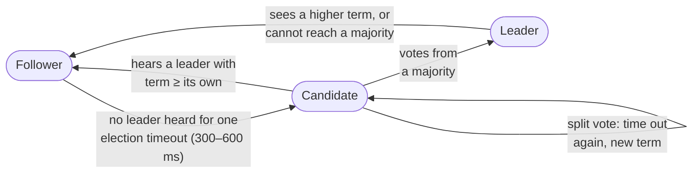
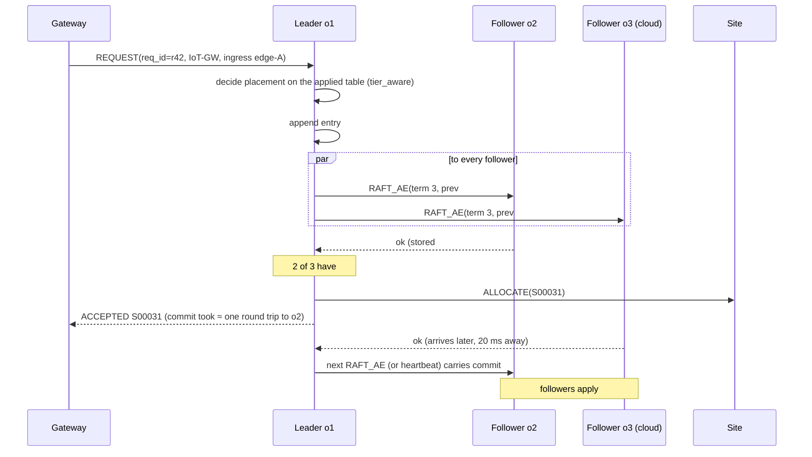
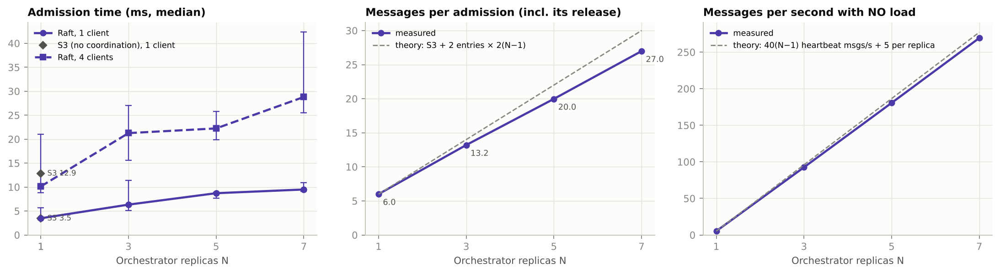
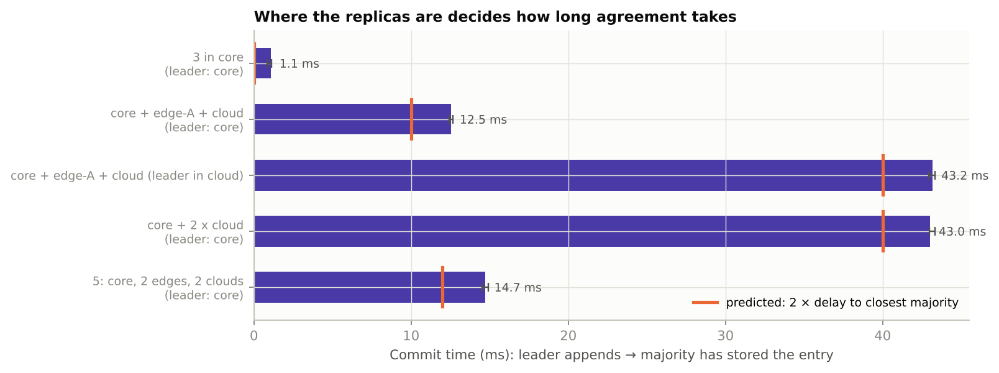
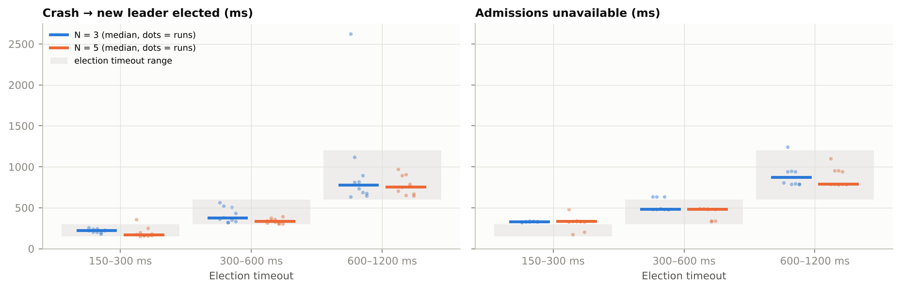
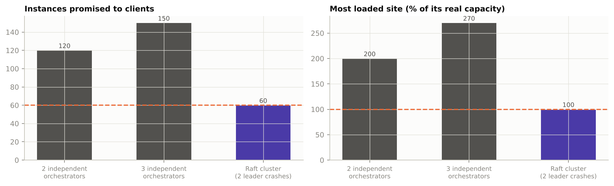
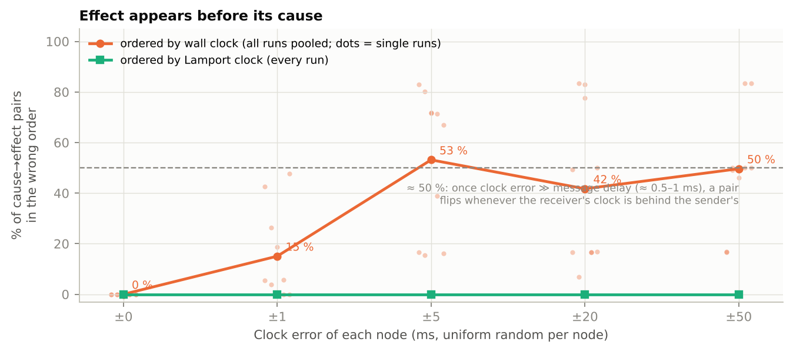

# Milestone 4 – Distributed Algorithms and Coordination
**Theme 3: Distributed Telecom Resource Management System (TeleRM)**
ICS 2403 – Distributed Computing & Applications · Week 4 · System version S4 (evolved from S3)

---

## 0. The short version

In S3 one orchestrator process owned the allocation table: the list of which service
instance runs where and how much of each site is reserved. If that process crashed, nobody
could admit anything, and its table was gone. Running two copies would not have helped: two
orchestrators that do not talk to each other each think they have the whole capacity, and
they hand out the same resources twice (we measured this in section 7.4).

In Milestone 4 we added **coordination**:

- **Leader election + consensus (Raft).** The orchestrator now runs as a **cluster of 3
  replicas** (o1 and o2 in the core, o3 in the cloud). The replicas elect one **leader**.
  Only the leader decides. Every decision ("admit S00007 on core-1", "release S00003") is
  written as an entry in a **replicated log**. An entry counts (is *committed*) only once a
  **majority** of the replicas have stored it. Each replica then applies the committed
  entries, in the same order, to its own copy of the table, so all copies stay identical.
  If the leader crashes, the others notice within a fraction of a second, elect a new
  leader, and carry on with nothing confirmed lost.
- **Logical clocks + event ordering (Lamport clocks).** Every message now carries a counter,
  `lc`. Using it, events recorded on different machines can be put in an order that never
  shows an effect before its cause, even when the machines' wall clocks disagree.

In hospital terms: the single referral office became a **board of three referral
officers** (two at the regional hospital, one at the national hospital). One of them chairs
the board (the leader) and makes the decisions. A decision is only final when it is written
into the minutes and at least two of the three have their own copy. If the chair collapses,
the other two notice that the chair has gone quiet, vote a new chair, and continue from the
same minutes. And every letter between hospitals now carries a running number, so the
records office can always tell which letter was a reply to which, whatever the clocks on the
office walls say.

**What we found (details in section 7):**

| Question | Answer |
|---|---|
| What does coordination cost? | With 3 replicas: +2.8 ms per admission on one machine (the commit itself 1.2 ms), +7 messages per admission, 92 messages/s of heartbeats when idle. Messages and the leader's work grow linearly with the number of replicas |
| How long does agreement take? | 2 × the delay to the closest majority, plus 1–3 ms. A far-away replica costs nothing if a majority is close: core + edge + cloud commits in 12.5 ms, but 43 ms if the leader sits in the cloud |
| What happens when the leader crashes? | New leader in 0.17–0.77 s (median, by election timeout); admissions pause for 0.33–0.87 s; 0 failed requests and 0 lost admissions in 60 crashes |
| Is it consistent? | Two uncoordinated orchestrators promised 120 instances into room for 60 (every site at 200 %). The Raft cluster promised exactly 60, with two leader crashes during the run, and all replicas ended identical |
| Can we trust timestamps? | No. With ±1 ms of clock error, 15 % of cause→effect pairs appear reversed; beyond ±5 ms about half. Lamport order was wrong 0 times in 18 045 pairs |

## 1. What changed from S3 to S4

| Part | S3 (Week 3) | S4 (Week 4) |
|---|---|---|
| Orchestrator | One process (single point of failure) | **Raft cluster of N replicas** (default 3: o1, o2 core; o3 cloud) |
| Who decides | The only orchestrator | **The elected leader**; followers answer `NOT_LEADER` with a hint to the leader |
| Allocation table | In one process's memory | **Replicated state machine**: rebuilt on every replica from the committed log; log saved to disk |
| Finding the orchestrator | Registry name `orchestrator` | Same name, but now an **alias** that the leader registers **with its term**; an older term is refused (fencing) |
| Client retries | None | Requests carry a **request id**; a retried request is recognised and not admitted twice |
| ALLOCATE on a site | Duplicate id = error | Duplicate id **with the same request** = harmless retry (idempotent) |
| Ordering of events | Wall-clock timestamps only | **Lamport clock in every message**; optional event log with both clocks |
| Clock problems | Not testable | `TELERM_CLOCK_SKEW_MS` makes a process's clock wrong on purpose |
| Docker deployment | 10 containers | 12 containers (`orch-o1`, `orch-o2`, `orch-o3` instead of `orchestrator`) |

Nothing else had to change. Gateways and sites still look up the name `orchestrator`; they
just retry for a few seconds if it is moving (`call_service(..., retry_s=...)`). Without
`--raft-id`, the manager runs exactly as S3 (and as S1/S2 without `--registry`), which is
what lets us compare S3 and S4 in section 7.1.

## 2. Choosing the coordination mechanism

The brief lists five mechanisms. What each would mean for TeleRM:

| Mechanism | What it gives | Would it fix TeleRM's problem on its own? |
|---|---|---|
| **Leader election** (e.g. Bully, Ring) | Exactly one node acts as coordinator; a new one is chosen if it fails | **Partly.** A new leader would start with an *empty* table, and during a network split two nodes can both believe they are leader |
| **Consensus** (Paxos, Raft) | All replicas agree on the *same sequence* of decisions, despite crashes, as long as a majority is up | **Yes.** It includes leader election *and* makes the table survive the leader |
| **Distributed synchronization / mutual exclusion** (central lock, Ricart–Agrawala, token ring) | Only one node at a time in a critical section | **No.** It stops two orchestrators deciding at once, but the table still lives in one place. (Week 6 covers mutual exclusion and deadlock.) |
| **Logical clocks** (Lamport, vector) | An order of events consistent with cause and effect, without synchronised clocks | **No**, not for agreement. But it solves a real TeleRM need: ordering events from many nodes in the telemetry and logs |
| **Physical clock sync** (NTP, PTP) | Clocks that agree to within ms (NTP) or µs (PTP) | **No.** Clock sync reduces errors but never makes "same timestamp" mean "same decision". 5G fronthaul does use PTP, but for radio timing, not for control decisions |

**Our choice: Raft for consensus (which includes leader election), plus Lamport clocks for
event ordering.**

Why Raft rather than Paxos: both give the same guarantees, but Raft was designed to be
understandable. It has a strong leader, a single log, and three clear sub-problems
(election, replication, safety). Raft is also what real telecom and cloud control planes
use. Kubernetes stores all cluster state in etcd, which uses Raft. The ONOS and
OpenDaylight SDN controllers keep their clustered state with Raft-based stores.
Cloud-native 5G cores run on Kubernetes, so their control state ultimately sits on Raft too.

Why Lamport rather than vector clocks: Lamport clocks are one integer per message (a few
bytes) and give exactly what we need, a cause-respecting total order. Vector clocks can also
tell "concurrent" from "ordered", but cost one counter *per node* in every message. That is
noted as a possible extension.

## 3. The algorithm: Raft in TeleRM


*Figure 1. TeleRM S4 (editable: TeleRM_S4_Architecture.drawio). Purple = new in S4: the three
orchestrator replicas and the Raft messages between them.*

### 3.1 The three roles and the term

Each replica is in one of three roles:



Time is divided into **terms** (1, 2, 3 …). A term starts with an election and has at most
one leader. Every message carries the sender's term. Anyone who sees a higher term than its
own adopts it and becomes a follower. This is how an old leader that wakes up finds out it
has been replaced.

### 3.2 Leader election

1. A follower that hears nothing from a leader for its **election timeout** becomes a
   candidate. The timeout is random, between 300 and 600 ms, so two followers rarely time
   out together.
2. The candidate increases the term, votes for itself and sends `RAFT_RV` (request vote) to
   every other replica. The message includes how up to date its log is (last index and term).
3. A replica grants **at most one vote per term**, and only to a candidate whose log is at
   least as up to date as its own.
4. With votes from a majority (2 of 3, 3 of 5), the candidate becomes **leader**.
   It immediately appends a `NOOP` entry and replicates it. When the NOOP is committed, the
   new leader knows that every older entry in its log is committed too. Only then does it
   serve requests and register the alias `orchestrator` with its term in the registry.
5. If nobody wins (a split vote), the candidates time out again and retry with a higher term.

### 3.3 Log replication and commit (one admission)



- `RAFT_AE` (append entries) carries the index and term of the entry *before* the new ones
  (`prev`). A follower accepts only if its own log has that entry, so logs can never have
  gaps or mismatches. If it does not match, the follower answers with a hint, and the leader
  backs up and resends.
- An empty `RAFT_AE` every 50 ms is the leader's heartbeat.
- **The leader does not wait for the slowest follower.** It waits only until a majority
  (itself included) has the entry. This is why the cloud replica (20 ms away) does not slow
  down commits when two replicas are in the core (section 7.2).
- Releases (`INSTANCE_EXIT` from a site) and resizes go through the log the same way.

### 3.4 What a crash looks like

| Time | Event |
|---|---|
| t = 0 | Leader o1 is killed (SIGKILL: no goodbye) |
| 0 → 300–600 ms | Followers hear nothing; requests to o1 fail; gateways and sites keep retrying |
| ≈ 300–600 ms | First follower times out, becomes candidate (term + 1), asks for votes |
| + 1 round trip | It has 2 of 3 votes → leader; appends NOOP |
| + 1 round trip | NOOP committed → registers the alias `orchestrator` with the new term → serves requests |
| later | o1 restarts, loads its log from disk, receives the entries it missed, rejoins as follower |

### 3.5 Why the replicas cannot disagree (safety, in plain words)

- **One leader per term.** Each replica votes once per term, and any two majorities of the
  same cluster share at least one replica. So two candidates cannot both collect a majority
  in the same term.
- **A committed entry is never lost.** It is stored on a majority. To win an election, a
  candidate needs votes from a majority, so at least one voter has the entry. That voter
  refuses any candidate whose log is less up to date. So every future leader has the entry.
- **Same order everywhere.** Followers accept entries only if the entry before them matches
  (`prev`). Logs are therefore identical up to the commit index, and every replica applies
  the same commands in the same order.
- **A deposed leader cannot do damage.** It can no longer get a majority, so it can no
  longer commit anything. The registry refuses an alias registration with an older term, so
  it cannot steal back the name `orchestrator` either.

### 3.6 Making client retries safe (request ids and idempotent side effects)

If the leader crashes after committing `ADMIT r42` but before answering, the gateway does
not know whether r42 was admitted. It retries with the **same request id**. The new leader
finds r42 in its replicated table (`req_index`), so it does not admit it a second time. It
just re-sends `ALLOCATE` and `ROUTE_SET`, which sites and the registry treat as harmless
repeats. Without request ids, every failover could create duplicate instances.

### 3.7 What we implemented, and what we left out

| Implemented (telerm/raft.py, about 390 lines) | Left out (with reason) |
|---|---|
| Randomised election timeout, RequestVote with up-to-date check | Log compaction / snapshots: logs stay small in our runs; needed for long-running systems |
| AppendEntries with consistency check, conflict truncation, back-off hint | Cluster membership changes (adding a replica at run time) |
| Batching of up to 256 entries per message | Pre-vote (prevents a rejoining node from disturbing the term) |
| NOOP on election; leader serves only after it is committed | Read leases (all our reads happen on the leader anyway) |
| Persistence: term, vote and log on disk; optional `--fsync` | Byzantine (lying) replicas: Raft assumes crash failures only (Week 7 discusses Byzantine behaviour) |
| Check-quorum: a leader that cannot reach a majority steps down | |
| Emulated one-way delay per peer (to place replicas "far apart" on one machine) | |

## 4. Lamport clocks and event ordering

### 4.1 The problem

Each node stamps its log lines and telemetry with its own wall clock. Real clocks drift:
NTP keeps servers within about a millisecond on a good LAN, and much worse across a WAN or
after a missed synchronisation. In TeleRM, an `ALLOCATE` from the core and its arrival at an
edge site are usually less than a millisecond apart. A clock error of a few milliseconds is
therefore enough to make the merged logs show the site starting an instance *before* the
orchestrator sent the order.

### 4.2 The rules (implemented in `protocol.py`, so every message gets them)

1. Before each local event or send, a process increments its counter: `lc = lc + 1`.
2. Every message carries the sender's `lc`.
3. On receiving a message: `lc = max(lc, message.lc) + 1`.

**Guarantee:** if event *a* can have influenced event *b* (same process and earlier, or *a*
is the send and *b* the receive of one message, or a chain of those), then `lc(a) < lc(b)`.
Sorting events by `(lc, node name)` therefore gives a total order in which no effect comes
before its cause.

**What it does not give:** if `lc(a) < lc(b)`, that does *not* prove that *a* influenced
*b*; they may be unrelated. Telling the two cases apart needs vector clocks.

### 4.3 Worked example

| Step | o1 (leader) | site core-1 | Message |
|---|---|---|---|
| 1 | event "allocate_send S00031": lc 40 → 41 | lc 12 | |
| 2 | send ALLOCATE: lc 42 | | carries lc = 42 |
| 3 | | receive: lc = max(12, 42) + 1 = 43 | |
| 4 | | event "allocate_recv S00031": lc 44 | |

Even if core-1's wall clock is 20 ms behind o1's, sorting by `lc` puts 41 (send) before 44
(receive).

### 4.4 Where it is used

- `log_event(kind, ...)` writes `{node, kind, lc, wall}` lines when `TELERM_EVENTLOG` is set.
  The events recorded are ALLOCATE send/receive, INSTANCE_EXIT send/receive, AppendEntries
  send/receive, and role changes.
- `analyse_events` (m4_run.py) matches every send with its receive and counts how often
  each clock puts them in the wrong order (experiment E5).

## 5. Complexity analysis

Notation: N = number of replicas, Q = ⌊N/2⌋ + 1 (majority), δᵢ = one-way delay from the
leader to follower i, sorted so δ₁ ≤ δ₂ ≤ …, H = heartbeat interval (50 ms),
T = election timeout (range [T₁, T₂]).

### 5.1 Messages

| Operation | Messages | Notes |
|---|---|---|
| Commit one log entry | **2(N − 1)** (one RAFT_AE + one reply per follower) | Batching: k entries in one RAFT_AE still cost 2(N − 1) messages, so the cost per entry falls to 2(N − 1)/k under load |
| One admission, end to end | S3 cost + 2(N − 1) (ADMIT) + 2(N − 1) later (RELEASE) | S3 cost = REQUEST, LIST_SITES, ALLOCATE, ROUTE_SET and their replies |
| Heartbeats, idle | 2(N − 1) per H → **40(N − 1) messages/s** at H = 50 ms | Paid even with no load. This is the price of failure detection within ~T |
| One election (one candidate) | **2(N − 1)** (RV + reply), plus the NOOP commit 2(N − 1) | With a split vote, repeat |
| Lamport clocks | **0 extra messages**; a few bytes extra per message | Piggybacked on every existing message |

The leader sends and receives 2(N − 1) messages per entry, while each follower handles only
2. **The leader's work grows linearly with N**, and this is the scalability limit of
leader-based consensus. That is why real deployments use 3 or 5 replicas, not 50.

### 5.2 Time (synchronization delay)

- **Commit time** ≈ processing + **2·δ_(Q−1)**: a round trip to the closest follower that
  completes a majority. With N = 3, that is the *nearest* follower. The far one does not
  matter.
- With `--fsync`, add one disk flush on the leader and one on the follower (in parallel
  with the network).
- **Admission time (S4)** = S3 admission time + commit time.
- **Failover time** ≈ time to notice (uniformly random in [T₁, T₂], mean (T₁ + T₂)/2) +
  election round trip + NOOP commit round trip + alias registration. With 300–600 ms that
  predicts about 450 ms plus a few ms, plus extra rounds when votes split.
- **Fault tolerance:** a cluster of N survives ⌊(N − 1)/2⌋ crashed replicas: 1 of 3, 2 of 5.
  4 replicas tolerate no more failures than 3, which is why N is odd.

### 5.3 State and storage

Each replica stores the whole log, O(number of entries), plus the table, O(active
instances + sites + links). Without compaction the log grows by two entries per admission
(ADMIT + RELEASE). Snapshots would bound it at O(table size).

### 5.4 Compared with the alternatives

| Approach | Messages per decision | Survives coordinator crash? | Consistent with a network split? |
|---|---|---|---|
| S3 single orchestrator | 0 extra | No | (only one copy) |
| N uncoordinated orchestrators | 0 extra | Yes | **No**: they overbook (section 7.4) |
| Primary–backup, no majority rule | 2 per backup | Yes | **No**: a split can create two primaries |
| Central lock service + shared table | ≥ 4 (lock, unlock, read, write) | Only if the lock service and table are replicated, which is consensus again | Depends on that service |
| **Raft (S4)** | **2(N − 1)** | **Yes, up to ⌊(N − 1)/2⌋ crashes** | **Yes**: only the majority side can commit |

## 6. Implementation map

| File | What changed for S4 |
|---|---|
| `telerm/raft.py` (new) | The Raft node: roles, terms, election, replication, commit, persistence, check-quorum, delay emulation |
| `telerm/manager.py` | `--raft-id/--raft-peers/...`; `apply()` = the deterministic state machine (ADMIT, RELEASE, RESIZE); `request_raft()` (decide → propose → commit → ALLOCATE outside the lock); request-id de-duplication; alias registration with term; `state_hash()` fingerprint |
| `telerm/protocol.py` | Lamport clock on every message (`tick`, `observe`), `log_event`, `TELERM_CLOCK_SKEW_MS` |
| `telerm/registry.py` | Alias fencing: REGISTER with an older term is refused |
| `telerm/naming.py` | `call_service(..., retry_s)`: follows `NOT_LEADER` hints and retries while a new leader is elected |
| `telerm/site.py`, `gateway.py` | Retry towards the orchestrator; duplicate ALLOCATE of the same instance is accepted |
| `telerm/deploy.py`, `config.json` (`s4`) | Three replicas in Docker Compose / local launch; replica delays from the topology |
| `m4_run.py`, `analyze_m4.py`, `run_m4_all.sh` | Experiments E1–E5 and their analysis |

How to run:

```
# whole system, local processes, with a 3-replica orchestrator
python -m telerm.deploy local --policy tier_aware

# Docker (12 containers)
python -m telerm.deploy compose > docker-compose.yml && docker compose up -d --build

# all Milestone 4 experiments, then charts and tables
sh run_m4_all.sh && python analyze_m4.py

# a quick demonstration: elect, admit, kill the leader, recover
python m4_run.py smoke
```

## 7. Experiments

All experiments follow hypothesis → design → implementation → measurement → analysis →
conclusion.

### 7.0 Test bed and fairness rules

- **Machine:** one cloud VM, 2 vCPU, 7.8 GB RAM, Ubuntu 24.04.5, Python 3.13.
- **Processes:** every replica, the registry and the fake sites are separate OS processes
  talking over TCP on one machine, so network delay is near zero unless we emulate it
  (`--peer-delay-ms`, E2).
- **Fake sites.** The experiments test coordination, not task processing, so sites are
  replaced by a light process (`m4_run.py fakesite`). It accepts ALLOCATE, records what it
  hosts, and sends INSTANCE_EXIT when an instance's holding time ends. This keeps the CPU
  free for the replicas.
- **Statistics.** Values are the **median** of the repetitions with (min–max). Up to 10
  processes share 2 cores, so a single repetition can be slow for reasons unrelated to the
  algorithm, and the median is less sensitive to that than the mean.
- **Defaults:** election timeout 300–600 ms, heartbeat 50 ms, no fsync, least_loaded
  placement.

### 7.1 E1: What does coordination cost? (overhead, message complexity, scalability)

**Hypothesis.** Raft adds about one round trip between replicas to each admission (≈ 1 ms on
one machine) and 2(N − 1) messages per log entry. Both the messages and the leader's work
grow linearly with N. The cluster also pays a constant background cost for heartbeats, even
with no load.

| Variables | |
|---|---|
| Independent | Number of replicas N (1, 3, 5, 7); concurrent clients (1, 4); `--fsync` on/off (N = 3); S3 single orchestrator as baseline |
| Dependent | Admission time, commit time, admissions/s, messages per admission (including its later release), idle messages/s, CPU of leader and followers |
| Controlled | 6 fake sites with ample capacity (nothing is blocked), 150 admissions per run, holding time 0.5 s (so every admission is followed by a release through the log), local processes, 3 repetitions |

**Results.**



| | S3 (no coordination) | Raft N = 1 | Raft N = 3 | Raft N = 5 | Raft N = 7 | Raft N = 3 + fsync |
|---|---|---|---|---|---|---|
| Admission, 1 client (ms) | 3.49 | 3.48 | 6.33 | 8.72 | 9.49 | 8.16 |
| ↳ commit part (ms) | – | 0.15 | 1.15 | 1.86 | 2.41 | 2.58 |
| Admissions/s, 1 client | 286 | 287 | 158 | 115 | 105 | 123 |
| Admissions/s, 4 clients | 308 | 390 | 186 | 177 | 138 | 157 |
| Messages per admission (+ its release) | 6.0 | 6.0 | 13.2 | 20.0 | 27.0 | 13.1 |
| Theory: 6 + 2 entries × 2(N − 1) | 6 | 6 | 14 | 22 | 30 | 14 |
| Messages/s with no load (whole cluster) | 5.3 | 5.3 | 92.5 | 180.6 | 269.3 | 93.1 |
| Leader CPU (% of a core), 1 client | 33.4 | 36.0 | 36.2 | 37.9 | 38.1 | 35.8 |
| ↳ leader CPU time per admission (ms) | 0.12 | 0.13 | 0.23 | 0.33 | 0.36 | 0.29 |
| Each follower's CPU (%) | – | – | 9.3 | 8.1 | 7.9 | 10.5 |

**Analysis.**

- **Messages grow exactly as the theory says.** Each extra pair of replicas adds about 7
  messages per admission (13.2 → 20.0 → 27.0). That is slightly under the 8 the theory
  predicts, because a RELEASE and a new ADMIT sometimes travel in the same AppendEntries
  (batching).
- **Idle cost is linear in N:** 92.5 → 180.6 → 269.3 messages/s, almost exactly
  40(N − 1) heartbeat messages plus about 5 per replica for the registry and telemetry.
  This cost is paid even when nothing happens. It is the price of noticing a dead leader
  within a few hundred milliseconds.
- **Commit itself is cheap on one machine** (1.2 ms for N = 3). Admission rises by more than
  that (3.5 → 6.3 ms) because three replicas now share two CPU cores with the clients and
  sites, and releases compete with admissions for the log. On separate machines that
  contention would disappear; the round trip would not.
- **The leader is the scalability limit.** Its CPU time per admission triples from S3 to
  N = 7 (0.12 → 0.36 ms), while each follower stays at about 8–10 % of a core, whatever N is.
  The leader sends and receives every message; a follower handles only its own.
- **fsync** (writing the log safely to disk before acknowledging) adds about 1.4 ms per
  commit here. On a real server with an SSD this is typically 0.1–1 ms. Without fsync, a
  replica that loses power can forget entries it acknowledged. Our runs only kill
  processes, which does not lose data already handed to the operating system.
- **With 4 clients, Raft N = 1 beats S3 (390 vs 308 admissions/s).** S4 releases the
  orchestrator's lock as soon as the decision is committed, while S3 held it through the
  ALLOCATE and ROUTE_SET calls (see failure log #2). With N ≥ 3, throughput is capped by one
  decision + one commit at a time. Batching several decisions into one commit would raise
  it (a Week 12 optimisation).

**Conclusion.** Hypothesis confirmed. Coordination costs 2(N − 1) messages per log entry,
40(N − 1) messages/s of heartbeats, about 1–2 ms per admission on one machine, and a leader
whose work grows linearly with N. **N = 3 is the sensible default:** it survives one crash
and costs about half of what N = 7 costs. N = 5 survives two crashes.

### 7.2 E2: Synchronization delay — where should the replicas be?

**Hypothesis.** The leader waits only for the closest majority. Commit time ≈ 2 × the
one-way delay to the follower that completes the majority, plus about 1 ms of processing.
So a far-away replica costs nothing as long as a majority is close, and the leader's
location matters most.

| Variables | |
|---|---|
| Independent | Replica locations (core, edge-A, edge-B, cloud, cloud-2) and which one is leader |
| Dependent | Commit time, admission time |
| Controlled | Emulated one-way delays from the topology (core–edge 5–6 ms, core–cloud 20 ms, edge–cloud 25–26 ms, cloud–cloud-2 2 ms); the chosen leader gets a short election timeout so it always wins; 40 admissions; 3 repetitions |

**Results.**



| Placement | Leader at | One-way delay to followers (ms) | Predicted commit (ms) | Measured commit (ms) | Admission (ms) |
|---|---|---|---|---|---|
| 3 replicas in the core | core | 0 / 0 | ≈ 0 | 1.1 | 5.5 |
| core + edge-A + cloud | core | 5 / 20 | 10 | 12.5 | 18.0 |
| core + edge-A + cloud | **cloud** | 20 / 25 | 40 | 43.2 | 49.3 |
| core + 2 × cloud | core | 20 / 20 | 40 | 43.0 | 52.0 |
| 5 replicas: core, 2 edges, 2 clouds | core | 5 / 6 / 20 / 20 | 12 | 14.7 | 20.4 |

**Analysis.**

- Every measurement is the prediction plus 1–3 ms. That extra is the same
  processing seen in E1, plus asyncio timer granularity.
- **The far replica is free when a majority is near.** In "core + edge-A + cloud", the cloud
  replica (20 ms away) does not appear in the commit time at all: core + edge already form a
  majority. With 5 replicas the same holds: the two clouds are never waited for.
- **Placing the leader badly costs 3.5×.** The same three locations with the leader in the
  cloud commit in 43 ms instead of 12.5 ms.
- **Spreading replicas buys safety and costs time.** All three in the core is fastest
  (1 ms), but one power cut at the core site takes out the whole cluster. Core + edge-A +
  cloud survives the loss of any one site and costs 12.5 ms.

**Conclusion.** Confirmed: **commit ≈ 2 × the delay to the closest majority + processing.**
For TeleRM the best trade-off is the S4 default: two replicas close together (core), one far
away (cloud) for safety, with leadership kept in the core.

| If you care most about… | Choose | Commit time |
|---|---|---|
| Fastest decisions | 3 in core | ≈ 1 ms |
| Surviving the loss of a whole site | core + edge + cloud, leader in core | ≈ 12.5 ms |
| Surviving 2 failures and a site loss | 5 replicas over core, edges and clouds | ≈ 15 ms |
| Never | a leader in the cloud | ≈ 43 ms |

### 7.3 E3: Leader crash — how fast is a new leader elected, and what do users notice?

**Hypothesis.** After the leader dies, a new one is elected after about one election
timeout (minimum of the followers' random timeouts) plus one round trip. With more
followers, the fastest random timeout is shorter, so elections are slightly faster. No
admission that was confirmed to a client is lost, and clients that retry do not fail.

| Variables | |
|---|---|
| Independent | Election timeout range (150–300, 300–600, 600–1200 ms); replicas N (3, 5) |
| Dependent | Crash → new leader elected; client-visible unavailability (longest gap between two successful admissions around the crash); split votes; failed client requests; catch-up time of the restarted replica; whether replicas end identical |
| Controlled | One client sending admissions continuously (retries for up to 15 s); leader killed with SIGKILL after 1.5 s; killed replica restarted afterwards; heartbeat 50 ms; 10 repetitions per setting (60 crashes in total) |

**Results.**



| N | Election timeout (ms) | Crash → new leader (ms) | Admissions unavailable (ms) | Split votes (in 10 runs) | Failed client requests | Restarted replica catch-up (ms) | Replicas identical afterwards |
|---|---|---|---|---|---|---|---|
| 3 | 150–300 | 223 (183–257) | 329 (325–337) | 0 | 0 | 181 | 10/10 |
| 3 | 300–600 | 374 (320–562) | 484 (478–637) | 0 | 0 | 229 | 10/10 |
| 3 | 600–1200 | 774 (636–2624) | 873 (786–2771) | 2 | 0 | 181 | 10/10 |
| 5 | 150–300 | 168 (152–357) | 332 (177–481) | 1 | 0 | 185 | 10/10 |
| 5 | 300–600 | 334 (304–396) | 483 (332–488) | 0 | 0 | 186 | 10/10 |
| 5 | 600–1200 | 755 (648–972) | 790 (784–1098) | 0 | 0 | 183 | 10/10 |

**Analysis.**

- **Election time follows the timeout.** The expected first timeout among k followers with
  timeouts uniform in [T₁, T₂] is T₁ + (T₂ − T₁)/(k + 1). For 300–600 ms that is 400 ms with
  2 followers and 360 ms with 4. Measured medians: 374 and 334 ms. More followers give
  slightly faster elections.
- **Split votes are rare but expensive.** 3 of 60 crashes needed more than one election
  round. The worst case (N = 3, 600–1200 ms) took 2.6 s instead of about 0.8 s.
- **Users notice 35–165 ms more than the election (medians).** Gateways and sites keep retrying
  every 50–150 ms, and the new leader must commit its NOOP and register its alias before
  serving. Faster client retries would shorten this, at the cost of more messages to a dead
  address.
- **Zero failed requests, zero lost admissions.** Every client request eventually succeeded
  through the new leader. In 7 of the 60 crashes, the request the client was waiting on had
  already been committed when the leader died. The retry was recognised by its request id
  and answered without admitting it a second time (section 3.6 in action). The restarted replica loaded its log from disk (74–94 entries)
  and caught up in about 0.2 s. All 60 runs ended with identical fingerprints on every
  replica.
- **The trade-off.** A shorter timeout means faster recovery but more false alarms. A
  leader that is only slow (a garbage-collection pause, a congested link) would be replaced
  needlessly. The timeout must be well above the heartbeat interval (50 ms) and the
  replicas' round-trip time (up to 50 ms for a cloud replica).

**Conclusion.** Confirmed. With the default 300–600 ms, a leader crash costs about 0.5 s
without admissions, with no lost or duplicated work. For TeleRM this is acceptable:
admissions are setup operations, and **traffic tasks never stop**, because gateways send them
straight to sites, which do not depend on the orchestrator.

### 7.4 E4: Consistency — what happens without coordination?

**Hypothesis.** Several orchestrators that do not coordinate each believe they own all the
capacity, so they promise it several times over and hand out the same instance ids. A Raft
cluster promises exactly the real capacity, even while its leader is killed, and all its
replicas end with the same table.

| Variables | |
|---|---|
| Independent | Setup: 2 or 3 independent S3 orchestrators (clients split between them) vs a 3-replica Raft cluster whose leader is killed twice (and restarted) during the run |
| Dependent | Instances acknowledged vs real capacity, load on the most loaded site, instance-id collisions, acknowledged-but-lost admissions, duplicate admissions of one request, replica fingerprints |
| Controlled | 6 sites × 4 000 mc; each request 400 mc and never released (true capacity = 60 instances); 150 requests from 6 concurrent clients; 3 repetitions |

**Results.**



| Setup | Acknowledged (capacity 60) | Overbooked sites (of 6) | Most loaded site | Same id, different instances | Acked but lost | Same request admitted twice | Replicas identical |
|---|---|---|---|---|---|---|---|
| 2 independent orchestrators | **120** | 6 | **200 %** | 60 | – | – | – |
| 3 independent orchestrators | **150** (all requests) | 6 | **270 %** | 100 | – | – | – |
| Raft cluster, 2 leader crashes | **60** | 0 | **100 %** | 0 | 0 | 0 | 3/3 runs |

(The same in all 3 repetitions.)

**Analysis.**

- **Without coordination, every promise is broken.** Two orchestrators admitted 120
  instances into room for 60: every site ended at twice its capacity. With three, all 150
  requests were accepted, with one site at 2.7×. In a real network this means vRAN-DUs and
  UPFs silently sharing CPU they were guaranteed, and missing their latency budgets.
- **Names collide too.** Each orchestrator numbers instances S00001, S00002 …, so different
  instances got the same id: 60 and 100 times. Routes and releases for one instance would
  hit another.
- **With Raft: exactly 60, never 61,** although the leader was killed twice during the run.
  Every acknowledged admission was still in the final table, no request was admitted twice
  (the request ids did their job), and all replicas ended with the same fingerprint.

**Conclusion.** Confirmed. This is the reason coordination exists: **adding replicas without
agreement makes the system less correct, not more available.** Raft gives both.

### 7.5 E5: Event ordering — wall clocks vs Lamport clocks

**Hypothesis.** When nodes' clocks disagree by more than the message delay (under 1 ms
here), ordering events by wall-clock time puts many effects before their causes. Ordering by
Lamport clock never does, whatever the clock error.

| Variables | |
|---|---|
| Independent | Clock error: each process's clock shifted by a random amount in ±0, ±1, ±5, ±20, ±50 ms (`TELERM_CLOCK_SKEW_MS`) |
| Dependent | Share of cause → effect pairs (ALLOCATE send → receive, INSTANCE_EXIT send → receive, AppendEntries send → receive) that each clock puts in the wrong order |
| Controlled | 3 replicas, 60 admissions with 0.3 s holding (so 60 exits), event logging on every process, 10 repetitions per clock error (different random clocks each time) |

**Results.**



| Clock error per node | Pairs checked (10 runs) | Wrong by wall clock | Wrong by Lamport clock | Apparent send → receive gap by wall clock (median of runs, range) |
|---|---|---|---|---|
| ±0 ms | 3 613 | 0 (0 %) | 0 | 0.59 ms (0.46 to 0.76) |
| ±1 ms | 3 613 | 544 (15.1 %) | 0 | 0.83 ms (0.05 to 1.71) |
| ±5 ms | 3 601 | 1 914 (53.2 %) | 0 | −0.69 ms (−5.83 to 4.64) |
| ±20 ms | 3 608 | 1 505 (41.7 %) | 0 | 3.92 ms (−19.0 to 17.1) |
| ±50 ms | 3 610 | 1 792 (49.6 %) | 0 | 3.03 ms (−22.2 to 26.6) |

A negative "gap" means the message was received, by the wall clocks, before it was sent.

**Analysis.**

- **Even ±1 ms of clock error is enough to break wall-clock ordering**, because an ALLOCATE
  or AppendEntries reaches the other process in about half a millisecond. NTP on a good LAN
  keeps clocks within about that range; across sites it is usually worse.
- **Beyond a few ms, the result is a coin toss per pair of nodes.** If the receiver's clock is
  behind the sender's by more than the delay, *every* message on that path appears to
  arrive before it was sent. This is why results swing between runs: each run draws new
  clocks. Pooled over many runs, the share levels off near 50 %.
- **Lamport order was wrong 0 times** in every run, as the rules guarantee.
- **Cost:** no extra messages, and about 10 bytes per message for the `"lc":12345` field.

**Conclusion.** Confirmed. For merging TeleRM's logs and telemetry from many nodes, sort by
`(lc, node)`, not by timestamp. Wall time stays useful for *durations* measured on one
machine, and for rough human-readable times.

### 7.6 E6: The whole system — does traffic notice a leader crash?

**Hypothesis.** Traffic tasks go user → gateway → site, and gateways cache routes, so killing
the orchestrator leader in the middle of a traffic run should not affect tasks at all. The only
cost of S4 visible to users should be a slightly slower admission.

| Variables | |
|---|---|
| Independent | System: S3 (one orchestrator) vs S4 (3 Raft replicas) vs S4 with the leader killed 8 s into the traffic |
| Dependent | Task throughput, loss, end-to-end latency (overall, and in the second before, during and after the kill); admission time |
| Controlled | Full system with real sites and gateways (local processes, M3 workload, tier_aware), 150 tasks/s, 3 s warm-up + 15 s measurement, 3 repetitions |

**Results** (`results/M4-traffic`, mean of 3 runs):

| System | Throughput (tasks/s) | Loss | Mean latency (ms) | p95 (ms) | Admission (ms) |
|---|---|---|---|---|---|
| S3 | 153.0 | 0 % | 37.4 | 64.1 | 6.6 |
| S4 | 153.0 | 0 % | 38.4 | 66.2 | 9.2 |
| S4, leader killed at 8 s | 153.0 | 0 % | 37.9 | 65.2 | 8.2 |

Around the kill (tasks sent in each 1-second window, all three runs): 442 sent in the second
before, 461 in the second after the kill and 466 in the next second. Every one of them
completed, with mean latencies of 36.8–42.2 ms. A new leader took over 0.41–0.52 s after each
kill.

**Docker check** (`results/M4-docker-check`). The same test was run in the 12-container
deployment (`docker compose`; replicas with 0.2-CPU quotas and the topology's delays: o3 is
20 ms from o1 and o2). The leader was killed with `docker kill` during a 50 tasks/s run. The
recorded run killed `orch-o3` (term 2); `orch-o1` took over (term 3), and the run finished
with 0 % loss and 38.9 ms mean latency. In that run, the leader before the kill was the
*cloud* replica, so admissions took 57.8 ms, against about 21 ms in an earlier run whose
leader was in the core. This is E2's "leader in the cloud" case appearing by chance: S4 does
not yet prefer core replicas as leaders (see section 10).

**Conclusion.** Confirmed. A leader crash is invisible to traffic. Only new admissions
wait about half a second. Coordination costs users about 2.6 ms per admission (6.6 → 9.2 ms)
and nothing per task.

### 7.7 Summary: coordination overhead, delay, consistency, scalability

| Property the brief asks about | What we measured | Result |
|---|---|---|
| Coordination overhead | E1 | +2.8 ms per admission (N = 3, one machine); +7.2 messages per admission (incl. release); 92 messages/s idle; leader CPU per admission ×2 |
| Message complexity | E1 | 2(N − 1) per log entry (confirmed: 13.2 / 20.0 / 27.0 per admission for N = 3 / 5 / 7); 40(N − 1)/s heartbeats |
| Synchronization delay | E2, E3 | Commit = 2 × delay to closest majority + 1–3 ms; failover ≈ election (≈ first random timeout) + 35–165 ms |
| Consistency | E4, E3, E5 | Never overbooked, never lost or duplicated an acknowledged admission, identical replicas in 3/3 + 60/60 runs; Lamport order 0 errors |
| Scalability | E1, E2 | Leader work ∝ N (the limit); followers constant; throughput 158 → 105 admissions/s from N = 3 to 7. Practical: N = 3 or 5. Beyond that: split the system into several Raft groups (e.g. one per region), each with its own leader |

## 8. Engineering log – Week 4 (failure-driven)

| # | What we changed | What failed | Why | Fix | Alternative considered | What we learned |
|---|---|---|---|---|---|---|
| 1 | First consistency test of 2 uncoordinated orchestrators | The test reported **0 overbooked sites**, although 120 instances had been accepted into room for 60 | Both orchestrators gave out the same ids (S00001 …). The fake site treated the second ALLOCATE of an id as a retry and ignored it, which hid the double booking | Every ALLOCATE carries the client's request id; same id + same request = retry, same id + different request = collision | Give each orchestrator its own id prefix (hides the collision problem instead of measuring it) | Check that the measuring tool can actually see the failure you are looking for |
| 2 | Raft orchestrator, 4 concurrent clients (trial run) | Raft was slower with 4 clients than with 1 (20.3 ms per admission, 193/s) | The orchestrator held its lock through the whole admission, including the ALLOCATE call to the site and ROUTE_SET, which do not need it | Release the lock as soon as the decision is committed; the reservation is already in the replicated table (≈ 255/s in the next trial) | Pipelining several uncommitted decisions (faster, but decisions would be made on uncommitted state) | Keep the critical section to exactly the part that must be serialised |
| 3 | Compared replica fingerprints after E1 | Fingerprints differed in 28 of 28 runs, although the allocation tables matched | The leader knows every site from the registry, while followers only know sites that appear in the log; idle sites were part of the fingerprint | Fingerprint only sites that have something allocated (E1's fingerprint column was discarded; E3/E4 used the fixed version) | Make followers sync sites from the registry too (adds non-replicated input to the state) | Only replicated state may go into a consistency check |
| 4 | Measured unavailability during a leader crash | One run reported 24 ms of unavailability although the new leader took 477 ms to be elected | A reply sent by the old leader just before it was killed reached the client after the kill and was counted as "first success after the crash" | Unavailability = longest gap between two consecutive successful admissions around the crash; E3 rerun | Exclude requests sent before the kill (needs the send time too) | A crash does not cut every message off at the same instant |
| 5 | Clock experiment with 3 random clock settings per skew | Wrong-order share jumped around (13 %, 62 %, 33 %, 39 %) with no clear trend | With only 5 processes, the result depends on which nodes happen to get the slower clocks | Rerun with 10 settings per skew and report the pooled share; explained the ≈ 50 % plateau | Fix the skews (would hide that the effect depends on the direction of the error) | A random factor with few draws needs more repetitions than one with many |
| 6 | Design: what if the leader commits an ADMIT and dies before answering? | (Found while designing, before testing) The client would retry and could be admitted twice | The client cannot know whether a timed-out request was carried out | Request ids recorded in the replicated table; ALLOCATE and ROUTE_SET made idempotent; E4 shows 0 duplicates with 2 crashes per run | Exactly-once delivery (impossible in general) | Retries are only safe when the operation can be recognised as a repeat |

## 9. Reproducibility record

| Item | Value |
|---|---|
| Code version | S4 (this zip). S3 behaviour: manager without `--raft-id`; S3 config frozen as `config_m3.json` |
| Machine | 2 vCPU, 7.8 GB RAM, Ubuntu 24.04.5, kernel 6.18 |
| Software | Python 3.13.15, psutil 7.2.2 |
| Ports | registry 8910, replicas 8900+, fake sites 8920+ (experiments); system defaults unchanged (8000–8202) |
| Raft settings | Election 300–600 ms unless varied; heartbeat 50 ms; batch ≤ 256 entries; commit timeout 3 s (5 s in E2); fsync off unless stated |
| Repetitions | E1 3, E2 3, E3 10, E4 3, E5 10, E6 3 |
| Seeds | E3/E4: repetition number; E5: 100 × repetition + skew (clock offsets per process are printed in `clocks.csv`) |
| Raw data | `results/M4/{overhead,placement,failover,consistency,clocks}.csv`; E6: `results/M4-traffic/runs.csv` and per-run `tasks.csv`, `leader_kill.json`; per-run logs, Raft logs (`raft-*.log.jsonl`) and event logs (`events-*.jsonl`) in `results/M4/<experiment>/` |
| Superseded data (kept for the failure log) | `failover_metricbug.csv` (before fix #4), `clocks_3seeds.csv` (before fix #5) |

Commands (about 35 minutes in total on this machine):

```
sh run_m4_all.sh        # E1-E6
python3 analyze_m4.py   # charts in results/M4-charts, tables in results/M4-summary.md
python3 m4_run.py smoke # 20-second demonstration: elect, admit, crash, recover
```

## 10. Limitations and next steps

- **One machine.** Replicas share 2 cores, which inflates admission times (E1). Message
  counts, election behaviour and consistency do not depend on this; absolute latencies do.
  E2 emulates network delay in software.
- **Crash failures only.** Raft tolerates replicas that stop, not replicas that lie
  (Byzantine faults). Week 7 discusses failure models, including Byzantine behaviour.
- **No log compaction.** The log grows by two entries per admission; a long-running system
  needs snapshots.
- **The decision and the action are not one transaction.** Raft guarantees that all replicas
  agree on "admit S00031 on core-1". It does not guarantee that core-1 actually started it.
  If the site is down, the leader commits a RELEASE afterwards, but in between the table and
  the site disagree. Making "reserve in the table" and "start on the site" succeed or fail
  together is exactly the **distributed transaction problem of Milestone 5 (two-phase
  commit)**.
- **No leader preference.** Any replica can become leader, including the cloud replica, which
  makes every commit about 3.5× slower (E2, and the Docker check in 7.6). A fix is to give
  core replicas a shorter election timeout than the cloud replica, or to let a far-away
  leader hand leadership to a core replica.
- **Throughput is bounded by one commit at a time.** Batching several admissions into one
  commit, and splitting the system into several Raft groups (one per region), are the
  scalability next steps (Week 12).
